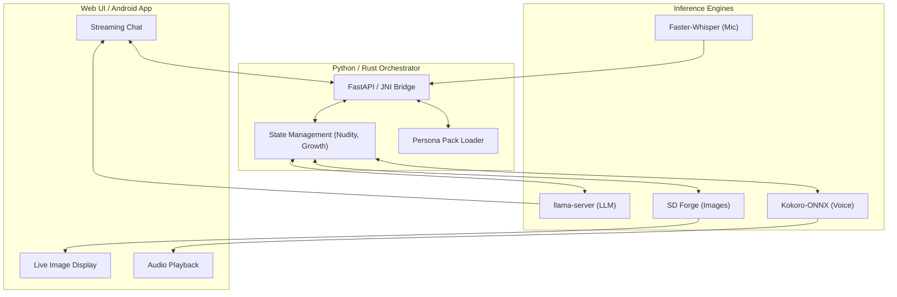

# Building Alice: The Architecture of a Private, Local AI Companion

In an era of centralized AI guardrails and cloud-hosted censorship, the demand for truly private, uncensored digital companions has never been higher. Today, we're diving into the technical architecture of **Alice**—a local-first AI companion that combines streaming chat, high-fidelity voice synthesis, and contextual image generation, all running on your own hardware.

## The Vision: Privacy Without Compromise

Alice was built on a simple premise: your most private conversations shouldn't leave your machine. By leveraging the latest in open-weights models and local inference engines, Alice provides an experience that is:
- **Uncensored:** No corporate filters or "As an AI language model..." lectures.
- **Private:** Zero data sent to the cloud. Your history, images, and voice stay on your disk.
- **Performant:** Real-time streaming and hardware-accelerated generation.

## The Technical Stack

Alice isn't just a Python script; it's a multi-layered system designed for performance across platforms.

### 1. The Python Backend (FastAPI)
The primary orchestrator is a FastAPI-based Python server. It manages the complex lifecycle of multiple sub-processes:
- **Llama-server:** Handles LLM inference via GGUF models.
- **SD Forge:** Powers the image generation engine with ADetailer and hires-fix support.
- **Kokoro-ONNX:** Provides high-quality, sentence-streamed TTS.
- **Faster-Whisper:** Manages real-time mic input and transcription.

### 2. The Rust Core
For mobile (Android) and future high-performance desktop paths, we've implemented a **Rust core**. This provides:
- **JNI Bindings:** Allowing the Android app to run local LLM and TTS inference natively.
- **Memory Safety:** Critical for handling large model weights and concurrent inference tasks.

### 3. The Persona Pack System
One of the most recent additions is a modular **Persona Pack** system. This allows users to swap between different character sets (like the newly added **Roman Senate** pack) without destroying their existing configurations.

## Deep Dive: Repetition Suppression & Growth

To prevent the "AI loop" where models repeat the same phrases, Alice implements a multi-tiered suppression system:
- **N-gram Blocking:** Dynamically identifies and bans overused phrase patterns.
- **Banned Phrases:** A static, configurable list (e.g., "moonlight", "shadows dance") injected into the system prompt.
- **Jaccard Similarity:** Re-rolls responses that are too structurally similar to recent history.

Furthermore, Alice's **Growth** system tracks relationship dynamics. In group chats, personas maintain "memos" about their interactions with each other, which are summarized and reinjected into their context, allowing for long-term character development.

## Conclusion

Alice represents a new wave of local AI applications—where the focus isn't just on the model, but on the *orchestration* of multiple specialized engines to create a seamless, private, and deeply immersive experience.

Whether you're exploring the political intrigues of the Roman Senate or simply looking for a private companion, Alice proves that the future of AI is local.

---

*Check out the project on [GitHub](https://github.com/cschladetsch/PyAlice)*
