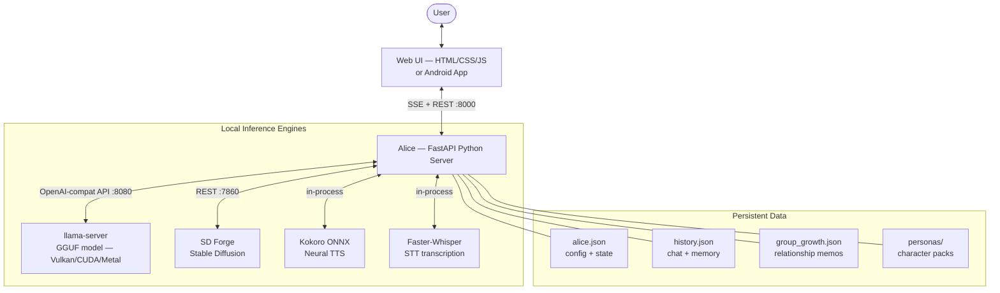
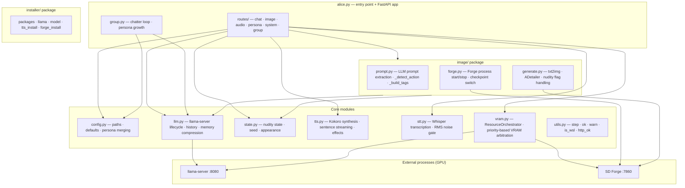
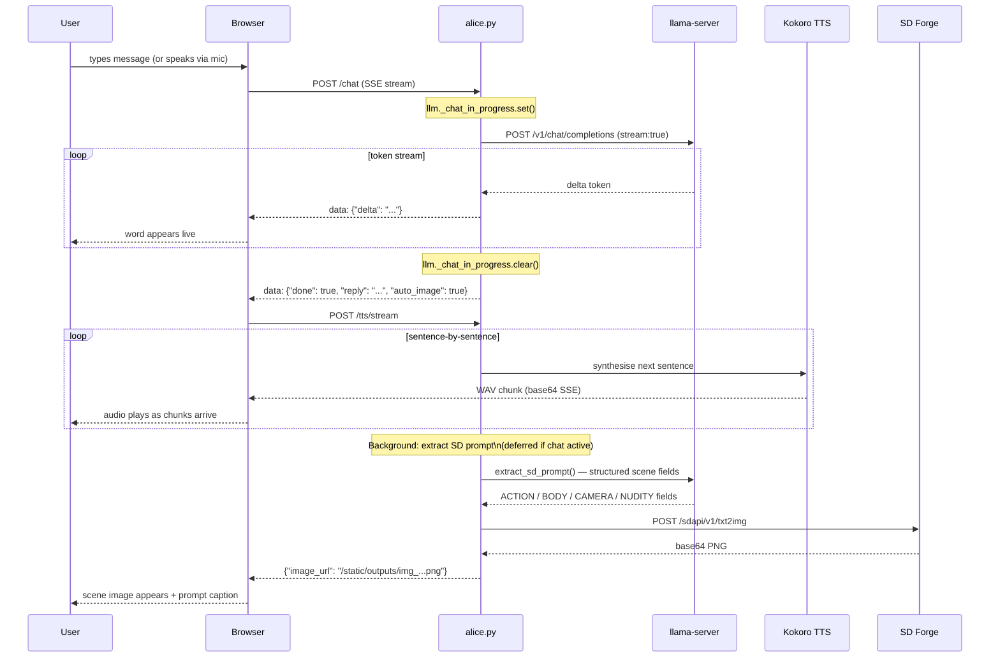
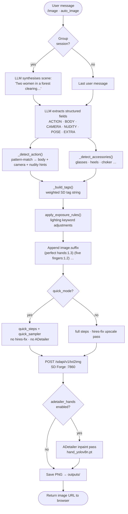
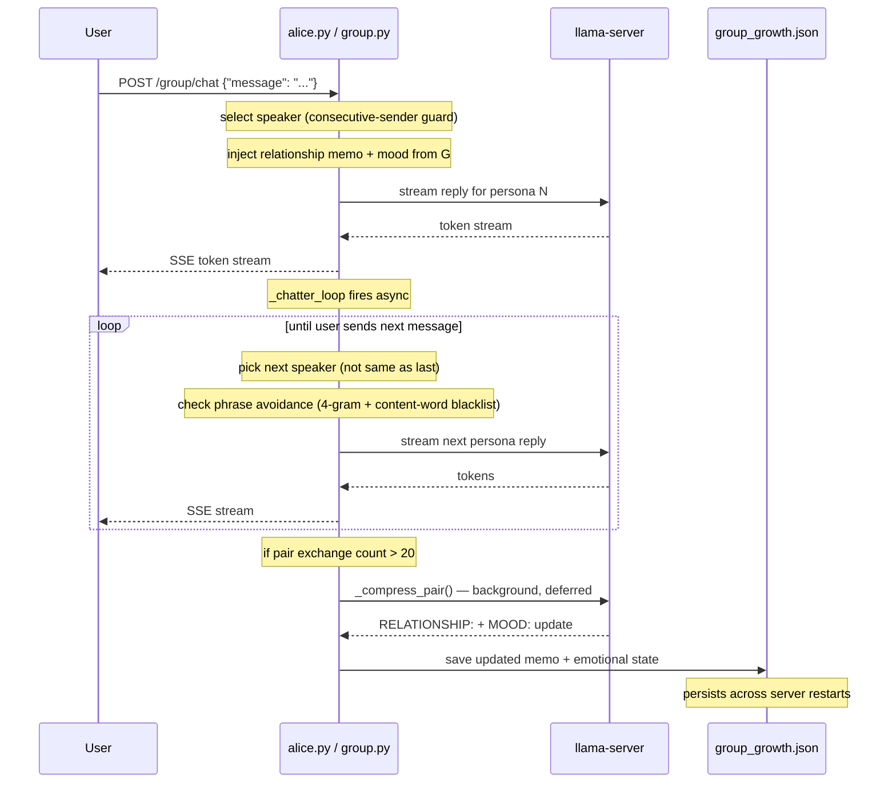
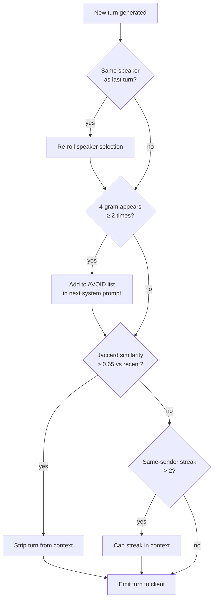
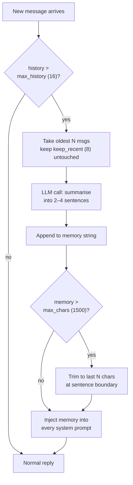

# Building Alice: The Architecture of a Private, Local AI Companion

In an era of centralised AI guardrails and cloud-hosted censorship, the demand for truly private, uncensored digital companions has never been higher. This article is a technical deep-dive into **Alice** — a local-first AI companion that combines streaming chat, high-fidelity voice synthesis, contextual image generation, and a multi-persona group chat system, all running entirely on your own hardware.

## The Vision: Privacy Without Compromise

Alice was built on a simple premise: your most private conversations should never leave your machine. By leveraging open-weights models and local inference engines, Alice provides an experience that is:

- **Uncensored** — no corporate filters, no "As an AI language model…" disclaimers.
- **Private** — zero data sent to the cloud. History, images, and voice stay on your disk.
- **Performant** — real-time token streaming, hardware-accelerated image generation, and sentence-level TTS pipelining.

---

## System Overview



---

## The Technical Stack

### Python Backend (FastAPI)

The primary orchestrator is a FastAPI server. It manages the complete lifecycle of multiple sub-processes and in-process engines:

- **llama-server** — GGUF model inference via an OpenAI-compatible `/v1/chat/completions` endpoint, streamed token-by-token.
- **SD Forge** — Stable Diffusion image generation with ADetailer post-processing and hires-fix upscaling.
- **Kokoro ONNX** — offline neural TTS, streamed sentence-by-sentence so the first sentence plays before the reply finishes generating.
- **Faster-Whisper** — real-time mic transcription via push-to-talk with auto-stop silence detection.

### Module Structure



### The Rust Core

For mobile (Android) and future high-performance desktop paths, a **Rust core** under `core/` provides:

- **JNI bindings** — the Android app runs local LLM and TTS inference natively via `alice-core`.
- **Memory safety** — critical for handling large model weights and concurrent inference tasks without garbage-collection pauses.

---

## Startup Sequence

Alice's startup is a carefully ordered sequence that brings each engine up in dependency order.

```mermaid
flowchart LR
    Start([python alice.py]) --> Cfg["Load alice.json\nconfig.py"]
    Cfg --> Port["Kill stale listener\non configured port"]
    Port --> LLMConnect["Connect to llama-server\nllm.load_llm()"]
    LLMConnect -->|not running| Spawn["Spawn llama-server\nsubprocess"]
    Spawn --> Retry["Retry /health\nup to 2 min"]
    LLMConnect -->|already up| Retry
    Retry --> Hist["Restore history + memory\nllm.load_history()"]
    Hist --> TTS_Load["Load Kokoro ONNX\ntts.load_tts() — background thread"]
    TTS_Load --> ForgeStart{Forge\nalready up?}
    ForgeStart -->|no| ForgeSpawn["Start webui.bat / webui.sh\nimage.start_forge()"]
    ForgeSpawn --> ForgeReady["Push sd_checkpoints_keep_in_cpu=False\nbefore first checkpoint load"]
    ForgeStart -->|yes| ForgeReady
    ForgeReady --> CkPt["Set SD checkpoint\nimage.set_forge_model()"]
    CkPt --> VRAM_S["Notify VRAM orchestrator\nvram.notify_llm_ready()"]
    VRAM_S --> Browser["Open browser\nlocalhost:8000"]
```



---

## Chat Turn — Request Flow

The core user experience: type, receive streaming reply, hear it spoken, see a scene image appear.



> **LLM non-contention:** `_chat_in_progress` is a `threading.Event` held for the full lifetime of any streaming chat call. Background LLM callers (SD prompt extraction, pair compression, scene synthesis) use `llm_chat_deferred()`, which raises immediately if the flag is set rather than queuing. This keeps chat responsive at all times.

---

## VRAM Arbitration

On 8 GB GPUs running a full-size model (e.g. Mistral-12B at ~6.5 GB), the LLM and Forge (~2.2 GB) cannot coexist. The `ResourceOrchestrator` in `vram.py` manages GPU ownership with a priority system.

```mermaid
flowchart TD
    subgraph Pri ["Priority — lower number wins"]
        P1["① INTERACTIVE\nchat · live STT"]
        P2["② GENERATION\nimage generation"]
        P3["③ BACKGROUND\nLLM idle warmup"]
    end

    ChatReq(["Chat request"]) -->|acquire 'llm'\nINTERACTIVE| Orch
    ImageReq(["Image request"]) -->|acquire 'forge'\nGENERATION| Orch

    Orch{"ResourceOrchestrator"} -->|evict lower-priority holders| Interrupt["interrupt() + unload()"]
    Interrupt -->|sleep 2 s — Windows mmap reclaim\n_llm_unload| PollRAM["wait_for_ram()\nRAM < 82%"]
    PollRAM --> Load["load requested resource"]

    Load --> LL["llama-server :8080"]
    Load --> FG["SD Forge :7860"]

    ImageDone(["Image done"]) -->|release 'forge'\nkeep checkpoint hot| Hot["Forge stays in VRAM\n(skip 15 s reload next time)"]
    Hot -->|_reload_default_async| LLMBg["LLM reloads in background\nat BACKGROUND priority"]
    LLMBg -->|_forge_unload +\n_wait_vram_free()| LL
```

Key design decisions:
- **Keep-hot**: after image gen, the Forge checkpoint stays in VRAM. The LLM evicts it lazily only when it actually needs to reload — saving ~15 s per image cycle.
- **Poll, don't sleep**: `_wait_vram_free()` samples `nvidia-smi` every 0.5 s until VRAM free ≥ 4 GB (or 15 s timeout), rather than a fixed blind sleep.
- **`sd_checkpoints_keep_in_cpu: false`** is pushed to Forge *before* each checkpoint load so the driver never duplicates model weights in CPU RAM (~2–4 GB saved).

---

## Image Generation Pipeline



---

## Group Chat & Persona Growth



### Repetition Suppression Stack



---

## Memory Compression

Long conversations compress automatically so context stays fresh without growing unbounded.



---

## Repetition Suppression & Growth

To prevent the "AI loop" where models repeat the same phrases, Alice implements a multi-tiered suppression system:

- **N-gram blocking** — dynamically identifies and bans 2–4 word phrases appearing too frequently within a session. Injected as a hard `AVOID:` constraint in the system prompt.
- **Banned phrases** — a static, user-configurable list (e.g. `"moonlight"`, `"shadows dance"`, `"as an AI"`) always blocked regardless of session content.
- **Jaccard deduplication** — strips turns with > 65% word overlap against a recent turn before building LLM context.

The **Growth** system tracks relationship dynamics in group chats. After every 20 exchanges between a pair of personas, a background LLM call generates a structured update:

```
RELATIONSHIP: They share a wary mutual respect, each probing the other's limits…
ALICE_MOOD: guarded but intrigued
MORRIGAN_MOOD: amused, watching carefully
```

These memos are saved to `group_growth.json` and injected into each persona's system prompt, allowing the relationship to deepen continuously across sessions.

---

## Conclusion

Alice is a demonstration that the future of AI companions is local. Rather than a single monolithic model, it orchestrates multiple specialised engines — each best-in-class for its domain — through a FastAPI backend that manages their lifecycles, arbitrates hardware resources, and keeps the user experience responsive.

The VRAM arbitrator, memory compression, repetition suppression stack, and group persona growth system are the pieces that transform a chatbot into a companion: one that remembers, responds in real time, speaks naturally, and generates visual context — entirely on your hardware.

---

*Project source: [github.com/cschladetsch/PyAlice](https://github.com/cschladetsch/PyAlice)*
