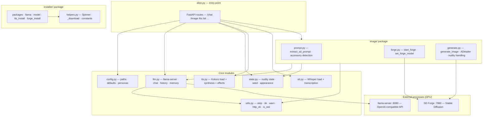
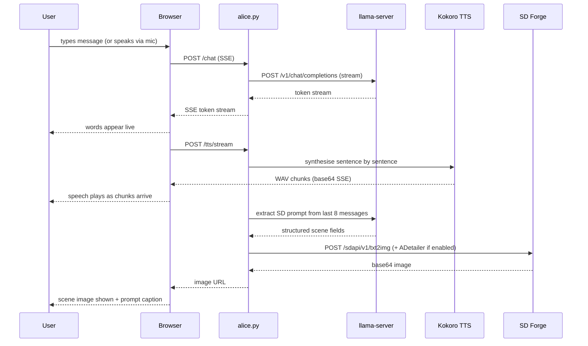
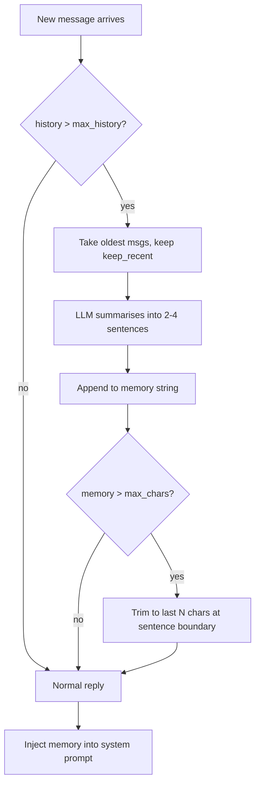

# Alice

> **⚠️ NSFW / 18+ — This project generates adult content. You must be 18 or older to use it.**

A local AI companion with streaming chat, voice, mic input, and contextual image generation. Everything runs on your own hardware — no cloud, no API keys, no subscriptions.

Powered by:
- [llama.cpp](https://github.com/ggerganov/llama.cpp) — local LLM inference via OpenAI-compatible server (GGUF, GPU-accelerated)
- [Stable Diffusion WebUI Forge](https://github.com/lllyasviel/stable-diffusion-webui-forge) — image generation
- [Kokoro ONNX](https://github.com/thewh1teagle/kokoro-onnx) — offline neural TTS
- [faster-whisper](https://github.com/SYSTRAN/faster-whisper) — offline STT (Whisper small.en)

---

## System Requirements

| | Minimum | Recommended |
|---|---------|-------------|
| **OS** | Windows 10 / macOS 12 / Ubuntu 22.04 | Windows 11 / macOS 14 / Ubuntu 24.04 |
| **Python** | 3.10 | 3.11–3.13 |
| **Git** | Any | Latest |
| **RAM** | 16 GB | 32 GB |
| **VRAM** | 4 GB | 8 GB+ |
| **Disk** | 20 GB free | 40 GB free |
| **GPU** | NVIDIA or AMD (Vulkan) / Apple Silicon (Metal) | RTX 2070 / RX 6700 / M2 or better |

> CPU-only mode works but LLM inference will be slow.
> WSL2 on Windows 11 is also supported.

---

## Installation & Running

```
python alice.py [--auto-image] [--no-speech] [--persona=<name>]
```

That's it.

**CLI flags:**

| Flag | Effect |
|------|--------|
| `--auto-image` | Enable auto image generation on every chat turn (overrides `auto_every: 0` in config) |
| `--no-speech` | Disable TTS entirely |
| `--persona=<name>` | Start with a specific persona (partial name match supported) |

On first run, `alice.py` detects missing dependencies and runs `install.py` automatically before starting. On later runs it binds to the configured `port` from `alice.json`, terminating any stale listener already holding that port before retrying startup.

`install.py` performs 6 steps:

| Step | What | Size |
|------|------|------|
| 1 | Python version check | — |
| 2 | pip packages (`fastapi`, `uvicorn`, `kokoro-onnx`, `faster-whisper`, `av`, …) | ~500 MB |
| 3 | llama-server binary (platform-appropriate build) | ~50 MB |
| 4 | LLM model — scans for existing GGUFs, or downloads default from HuggingFace | ~7 GB |
| 5 | Kokoro TTS model and voices | ~80 MB |
| 6 | Stable Diffusion Forge (git clone) + checkpoint + ADetailer extension + hand model | ~5 GB |

**Total first-install time: 15–45 minutes** depending on connection and hardware. Subsequent starts take ~30–60 seconds.

You can also run `install.py` directly at any time to re-run setup or add missing components.

---

## Configuration

`install.py` creates `alice.json` from `server/conf/alice.example.json` on first run. `alice.json` is gitignored — it is your personal config.

Key settings:

| Key | Default | Description |
|-----|---------|-------------|
| `name` | `"Alice"` | Character name shown in UI |
| `port` | `8000` | FastAPI port for Alice itself; `ALICE_URL` is derived from this |
| `model_path` | `""` | Absolute path to a GGUF model file (set by `install.py`) |
| `llama_server_path` | `""` | Path to `llama-server` binary (set by `install.py`, auto-detected if blank) |
| `system_prompt` | *(see example)* | LLM system prompt / personality |
| `appearance` | *(see example)* | SD prompt fragment for consistent character appearance |
| `negative_prompt` | *(see example)* | SD negative prompt — includes weighted hand/finger anatomy terms |
| `stt_silence_seconds` | `3` | Seconds of mic silence before recording auto-stops |
| `tts.voice` | `"af_nicole"` | Kokoro voice ID |
| `tts.speed` | `0.85` | TTS speed multiplier |
| `tts.chunk_chars` | `600` | Max characters per TTS synthesis chunk |
| `image.steps` | `25` | Diffusion steps |
| `image.suffix` | *(see example)* | Appended to every SD prompt — includes `(perfect hands:1.3), (five fingers:1.2)` |
| `image.auto_every` | `0` | Generate an image every N chat turns (0 = disabled) |
| `image.adetailer_hands` | `false` | Run ADetailer hand-repair pass after each generation (requires ADetailer extension) |
| `image.hires_fix` | `true` | Enable hires fix upscale pass |
| `forge_args` | *(platform default)* | Override Forge launch flags (e.g. `"--api --xformers"`) |
| `forge_venv_dir` | `""` | Optional path to an existing Forge virtualenv to reuse instead of creating `stable-diffusion-webui-forge/venv` |
| `llama_server.n_gpu_layers` | `33` | GPU layers offloaded — reduce if you get VRAM OOM |
| `llama_server.ctx_size` | `4096` | Context window in tokens |
| `llama_url` | `"http://127.0.0.1:8080"` | llama-server URL (override with `LLAMA_URL` env var) |
| `memory.max_history` | `16` | Compress history after this many messages |
| `memory.keep_recent` | `8` | Messages kept after compression |
| `memory.max_chars` | `1500` | Max chars in rolling memory summary |
| `demo.user_name` | `"Christian"` | Name shown for the auto-generated user side in demo mode |
| `demo.user_voice` | `"am_adam"` | TTS voice for the user side (`am_adam`, `am_michael`, `bm_george`, `bm_lewis`) |
| `demo.user_speed` | `0.88` | TTS speed for the user voice |
| `demo.user_pitch` | `0.88` | Pitch multiplier for the user voice (< 1.0 = lower/deeper) |
| `demo.user_persona` | `"default"` | Active user persona key (must match a key in `user_personas`) |
| `demo.user_personas` | *(5 built-in)* | Dict of named persona descriptions — each shapes how the user-side messages are written |

Restart `alice.py` after editing `alice.json`.

## Logging

Runtime logs are written to `log/`, which is gitignored. The Python server writes to `log/python-server.log`, and Rust components can join the same directory via the shared `ALICE_LOG_DIR` / `ALICE_LOG_LEVEL` environment contract.

Check `log/` first for startup failures, uncaught exceptions, and Forge connectivity errors.

---

## GPU Compatibility

`install.py` downloads the platform-appropriate `llama-server` binary automatically:

| Platform | GPU | Build |
|----------|-----|-------|
| Windows | NVIDIA or AMD | Vulkan (universal) |
| Windows fallback | CPU only | AVX2 |
| macOS Apple Silicon | Metal (auto) | arm64 |
| macOS Intel | Metal (auto) | x64 |
| Linux / WSL2 | NVIDIA CUDA | Ubuntu x64 |
| Linux fallback | CPU only | Ubuntu x64 |

Stable Diffusion Forge launch flags are set per-platform automatically and can be overridden via `forge_args` in `alice.json`:
- **Windows** — `--api --cuda-malloc --xformers`
- **macOS** — `--api --skip-torch-cuda-test` (Metal via MPS)
- **Linux / WSL2** — `--api --xformers`

Forge requires Python 3.10 or 3.11 for its virtualenv. `install.py` finds it automatically from PATH, Homebrew, or pyenv.
If you already have a working Forge virtualenv elsewhere, set `forge_venv_dir` in `alice.json` and Alice will pass that path through as Forge's `VENV_DIR`.

---

## LLM Model

Alice uses a GGUF model served by `llama-server` via the OpenAI-compatible API.

**Auto-detection order (during `install.py`):**

1. `model_path` already set in `alice.json`
2. Existing `.gguf` files in `models/`, `~/.cache/lm-studio/models/`, or GPT4All directory
3. Downloads `bartowski/dolphin-2.9.4-mistral-nemo-12b-GGUF` (Q4_K_M, ~7 GB) from HuggingFace

**Recommended models:**

| Model | VRAM | Size | Notes |
|-------|------|------|-------|
| `dolphin-2.9.4-mistral-nemo-12b-Q4_K_M` | 8 GB | ~7 GB | Default — good balance |
| `Mistral-7B-Instruct-v0.3-uncensored-Q4_K_M` | 6 GB | 4.4 GB | Lighter option |
| `Llama-3-8B-Lexi-Uncensored-Q4_K_M` | 8 GB | 4.9 GB | Alternative 8B |

To use a different model: set `model_path` in `alice.json` and restart.

---

## Personas

Four personas are included out of the box. Switch between them using the dropdown in the header. History is preserved across switches — a styled divider marks the transition. The SD checkpoint, TTS voice, and UI font switch automatically. The last reply is re-spoken with the new persona's voice immediately after switching.

| Persona | Character |
|---------|-----------|
| Default | Alice — enigmatic, sensual, literary |
| Egyptian Goddess | Nefertari — ancient, regal, divine |
| Victorian Lady | Isabelle — aristocratic, wickedly composed |
| Android | ARIA — synthetic, precise, curious |
| Forest Witch | Morrigan — wild, primal, ancient |

Alice's opening line is randomly chosen from a pool of 12 variations on each page load and after clearing history.

Add your own in `personas.json` (created from `conf/personas.example.json` on first run):

```json
{
    "Noir": {
        "system_prompt": "You are a hard-boiled detective ...",
        "appearance": "woman, dark hair, trench coat, film noir lighting"
    }
}
```

Per-persona options: `system_prompt`, `appearance`, `negative_prompt` (appended to base), `tts` (`voice`, `speed`, `effects`), `image` (`suffix`, `steps`, `cfg_scale`, …), `sd_model`, `name`.

---

## Conversation Memory

Alice maintains a rolling memory so long conversations don't lose earlier context:

- **History** is saved to `history.json` after each reply and reloaded on startup.
- When history exceeds **16 messages**, the oldest 8 are summarised by the LLM into a brief paragraph stored as `memory`.
- That memory paragraph is prepended to the system prompt on every subsequent request.
- The memory buffer is capped at **1500 characters** and trimmed at the nearest sentence boundary to avoid cutting mid-sentence.

**Why 1500 characters?** The memory string is injected into every system prompt, counting against the context window. With the default `ctx_size = 4096` tokens, ~375 tokens (≈ 1500 chars) is a safe budget. If you increase `ctx_size`, raise `memory.max_chars` proportionally in `alice.json`.

- **Clear** — the Clear button wipes history, memory, and `history.json`.
- Memory is also cleared when switching personas or models.

---

## Using Alice

### Chat

Type a message and press **Enter**. Alice streams her reply word-by-word, speaks it aloud, then generates a contextual image.

Press **ESC** or click **Stop** to interrupt at any time — Stop is always enabled and halts TTS, STT recording, chat streaming, and image generation simultaneously. Messages are capped at 4000 characters.

### Microphone (push-to-talk)

Click **Mic** to start recording. Click again to stop manually, or wait for the silence auto-stop (default 3 seconds, configurable via `stt_silence_seconds`).

The small arrow next to the Mic button opens a device selector — your chosen device is remembered across sessions.

After recording, Alice transcribes and sends automatically.

### Voice (TTS)

Alice speaks every reply using Kokoro neural TTS. Speech is streamed sentence-by-sentence — the first sentence plays while the rest is still being synthesised.

| Control | Action |
|---------|--------|
| Stop / **Esc** | Halt TTS, STT, chat, and image generation immediately |
| Mute / **M** | Toggle voice on/off (keyboard only) |
| Re-say / **R** | Replay the last spoken reply (keyboard only — no re-synthesis) |

**Keyboard shortcuts** (when the text input is not focused):

| Key | Action |
|-----|--------|
| `M` | Toggle mute |
| `R` | Re-say last reply |
| `Delete` | Delete current image |
| `Esc` | Stop / interrupt |

Available voices: `af_nicole`, `af_bella`, `af_sarah`, `af_sky` (American female) · `am_adam`, `am_michael` (American male) · `bf_emma`, `bf_isabella` (British female) · `bm_george`, `bm_lewis` (British male). Each persona sets its own default voice; the dropdown overrides it for the session.

### Image panel

The right panel shows the generated scene image. Below the image a **prompt caption** shows the SD tags that produced the current image. Click the caption (or the **+** button) to open the prompt editor — edit the extracted prompt, adjust Steps/CFG sliders, and click **Regenerate**.

Press **Delete** while an image is active to remove it from disk and history.

Thumbnail strip at the side shows the session's image history. Click any thumbnail to view it and load its prompt. Hover for the SD prompt and timestamp.

Expand **Negative prompt** at the bottom of the editor to inspect the active negative prompt.

### Image quality — hands and fingers

The default negative prompt includes explicit wrong-count penalties (`(six fingers:1.9)`, `(seven fingers:1.9)`, etc.) and the image suffix includes `(perfect hands:1.3), (five fingers:1.2)`.

For the best hand quality, enable ADetailer post-processing in `alice.json`:

```json
"image": {
    "adetailer_hands": true
}
```

ADetailer runs a second inpaint pass targeting detected hands using `hand_yolov8n.pt`. The extension and model are installed automatically by `install.py`.

### Accessories

Alice will wear accessories mentioned in your message. Recognised terms:

| Mentioned | SD tag added |
|-----------|-------------|
| glasses / spectacles | `(wearing glasses:1.3)` |
| sunglasses | `(wearing sunglasses:1.3)` |
| hat / cap / beret | `(wearing hat:1.3)` |
| choker / collar | `(choker necklace:1.3)` |
| stockings / thigh-highs | `(thigh-high stockings:1.3)` |
| heels / stilettos | `(high heels:1.3)` |

### Seed pinning

The 🔒 button pins the current seed, locking the face/character design across subsequent generations. Click again or use `/seed/unpin` to return to random seeds.

### Manual image generation

Use the **Image** button or type a command:

```
/image
/image candlelight, close up, warm glow
/image no blur, no shadows
/auto-image
```

Prefix a token with `no ` to push it to the negative prompt. All other tokens are prepended to the positive prompt.

`/auto-image` toggles automatic image generation on/off for the session (same as `--auto-image` at startup). The input placeholder briefly shows `Auto-image ON` or `Auto-image OFF` as confirmation.

### Demo mode

**Demo** puts Alice on autopilot — the system generates both sides of the conversation, speaks them, and generates images, indefinitely.

Click **Demo** to start. The button shows the current turn count (`Demo: ON (4)`). Click again or press **Stop** to end.

The **Type dropdown** (left of the Demo button) controls how the generated user-side messages are written. Five personas are built in (`default`, `intellectual`, `dominant`, `romantic`, `playful`); add your own in `alice.json` under `demo.user_personas`.

The user side is spoken in a separate male voice (`am_adam` by default) with independent speed and pitch settings, both configurable in `alice.json`. Demo pauses for a random 1.5–4s between turns and builds conversational intensity across a five-stage arc (opening → warming up → building → intimate → deeply connected). Typing into the chat input or clicking Stop ends the demo immediately.

### Model switcher

The leftmost dropdown lists models available from the llama-server. Switching clears history and forces model re-detection on the next request.

---

## Directory Structure

The current repo layout is split by runtime: `alice.py` is a thin root launcher, the Python app lives under `server/`, the Rust core/bindings live under `core/`, and runtime logs go to `log/`.

```
alice/
├── alice.py                  ← entry point — FastAPI app + startup
├── config.py                 ← paths, defaults, load/save config, personas
├── llm.py                    ← llama-server lifecycle, chat, history, memory
├── state.py                  ← shared mutable runtime state (nudity, seed, etc.)
├── tts.py                    ← Kokoro TTS load + synthesis + effects
├── stt.py                    ← Whisper STT load + transcription
├── utils.py                  ← step/ok/warn, http_ok, wait_for, is_wsl
├── install.py                ← installer entry point (thin orchestrator)
│
├── routes/                   ← FastAPI route modules
│   ├── chat.py               ← POST /chat (SSE streaming)
│   ├── audio.py              ← GET /voices · POST /voice · /tts · /tts/stream · /stt
│   ├── image_api.py          ← POST /image · /reroll · /generate · /interrupt · /seed
│   ├── persona.py            ← GET /personas · POST /persona/{name}
│   └── system.py             ← GET /info · /history · /negative · /demo/prompt · /demo/user-personas · POST /model · /auto-image · /demo/user-persona · DELETE /image
│
├── image/                    ← image generation package
│   ├── prompt.py             ← SD tag utilities, LLM prompt extraction, accessory detection
│   ├── forge.py              ← Forge process lifecycle + Python detection
│   └── generate.py           ← txt2img API call, nudity/clothing handling, ADetailer
│
├── installer/                ← installer steps package
│   ├── helpers.py            ← Spinner, download utils, shared constants
│   ├── packages.py           ← step 1-2: Python check + pip install
│   ├── llama.py              ← step 3: llama-server download
│   ├── model.py              ← step 4: GGUF model selection + download
│   ├── tts_install.py        ← step 5: Kokoro TTS model download
│   └── forge_install.py      ← step 6: Forge clone + checkpoint + ADetailer
│
├── conf/                     ← example / template config files (committed)
│   ├── alice.example.json
│   └── personas.example.json
│
├── static/                   ← web UI
│   ├── index.html
│   ├── app.js
│   ├── style.css
│   └── outputs/              ← generated images (gitignored)
│
├── tests/                    ← pytest test suite (247 tests)
│   ├── conftest.py
│   ├── test_api.py           ← API endpoint tests
│   ├── test_audio.py         ← _tts_clean, _emotion_speed
│   ├── test_config.py        ← config loading and persona merging
│   ├── test_image_utils.py   ← clean_tags, exposure rules, nudity keywords
│   ├── test_install.py       ← llama-server asset selection
│   ├── test_llm.py           ← history ops, memory compression
│   ├── test_prompt.py        ← SD prompt extraction, action/accessory detection
│   ├── test_state.py         ← image saving, RE_CLOTHE, nudity patterns
│   └── test_tts.py           ← TTS effects, chunking, crossfade
│
├── alice.json                ← your personal config (gitignored)
├── personas.json             ← your personas (gitignored)
├── history.json              ← conversation history (auto-created, gitignored)
├── models/                   ← GGUF models (gitignored)
│   └── tts/                  ← Kokoro model files
├── llama-cpp/                ← llama-server binary (gitignored)
└── stable-diffusion-webui-forge/  ← auto-cloned by install.py (gitignored)
    ├── extensions/adetailer/ ← ADetailer extension (auto-cloned)
    └── models/adetailer/     ← hand_yolov8n.pt (auto-downloaded)
```

---

## Ports

| Port | Service |
|------|---------|
| `alice.json.port` (default `8000`) | Alice (FastAPI) |
| 7860 | Stable Diffusion Forge |
| 8080 | llama-server (OpenAI-compatible API) |

---

## Architecture

### Module structure



### Request flow — chat turn



### Startup sequence

```mermaid
flowchart LR
    A([python alice.py]) --> B[config.py — Load alice.json]
    B --> C[llm.load_llm — Connect to llama-server]
    C -->|not running| D[llm._start_server — Spawn llama-server]
    D --> E[Retry until ready — up to 2 min]
    C -->|already up| E
    E --> F[llm.load_history — Restore history + memory]
    F --> G[tts.load_tts — Load Kokoro ONNX]
    G --> H{Forge running?}
    H -->|no| I[image.start_forge — webui.bat / webui.sh]
    H -->|yes| J
    I --> J[image.set_forge_model — Select checkpoint]
    J --> K([Open browser — localhost:8000])
```



### Memory compression



---

## Testing

From the repo root:

```
python -m pytest server/tests -v
```

```powershell
cd core
$env:PYO3_USE_ABI3_FORWARD_COMPATIBILITY='1'
cargo test -p alice-core -p alice-core-python
```

Coverage includes config loading, image tag utilities, SD prompt extraction and accessory detection, installer asset selection, TTS effects, audio markdown cleaning, LLM history operations and memory compression, state utilities, API endpoints, shared logging bootstrap, and Forge-unavailable error handling. No external services are required — heavy dependencies are stubbed in `server/tests/conftest.py`.

---

## Troubleshooting

### "Run install.py first" on startup
Dependencies are missing. Run `python install.py`.

### No sound / TTS disabled
Look for `WARNING: TTS models not found — run install.py` in the terminal. Run `install.py` to download Kokoro files.

### LLM server not connecting
- Check that `llama_server_path` and `model_path` are set correctly in `alice.json`
- Alice retries in the background for up to 2 minutes after startup
- You can also start `llama-server` manually and set `LLAMA_URL` env var

### Out of VRAM
- Reduce `llama_server.n_gpu_layers` in `alice.json` (try 20 or lower)
- Reduce image `width`/`height` to 512×512
- Use a smaller quantised model (Q4_K_S instead of Q4_K_M)

### Images not generating
- Visit `http://localhost:7860` — Forge should be running
- Forge starts in a separate console window; check it for errors
- Forge auto-restarts on the next image request if it died
- If Alice reports `Forge is unavailable at ...`, verify `forge_url` in `alice.json` and inspect `log/python-server.log`
- If Forge's local venv is broken but another checkout already works, set `forge_venv_dir` in `alice.json` to reuse that existing virtualenv

### ADetailer error on image generation
- Ensure the ADetailer extension is present in `stable-diffusion-webui-forge/extensions/adetailer/`
- Run `python install.py` to clone it automatically
- If the error persists, set `"adetailer_hands": false` in `alice.json` to disable it

### Forge fails to start
- Forge requires Python 3.10 or 3.11 — install via `brew install python@3.11` or `apt install python3.11`
- On Windows, try reusing a known-good Forge venv with `forge_venv_dir`
- On macOS, Forge uses Metal (MPS) automatically — no CUDA needed
- Override launch flags via `forge_args` in `alice.json` if needed

### WSL2 (Windows Subsystem for Linux)
- The browser opens automatically via `explorer.exe`
- If `localhost:8000` doesn't load in your Windows browser, use the WSL2 IP printed at startup
- For GPU acceleration, install the [NVIDIA CUDA WSL2 driver](https://developer.nvidia.com/cuda/wsl) on the Windows host

### Whisper transcribes nothing / "Could not hear anything"
- Check the mic device selector next to the Mic button
- Ensure the correct input device is selected and not muted in system sound settings
