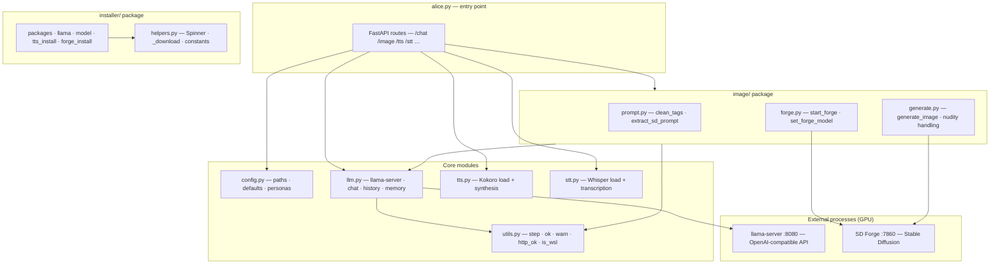
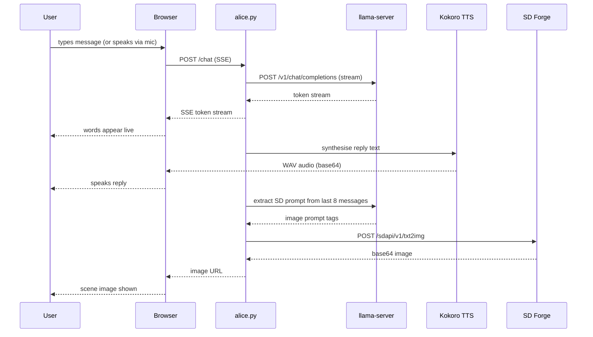
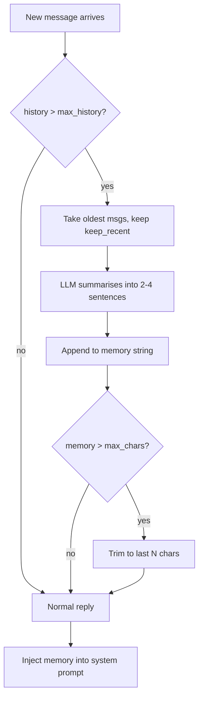

# Alice

> **⚠️ NSFW / 18+ — This project generates adult content. You must be 18 or older to use it.**

A local AI companion with streaming chat, voice, mic input, and contextual image generation. Everything runs on your own hardware — no cloud, no API keys, no subscriptions.

Powered by:
- [llama.cpp](https://github.com/ggerganov/llama.cpp) — local LLM inference via OpenAI-compatible server (GGUF, GPU-accelerated)
- [Stable Diffusion WebUI Forge](https://github.com/lllyasviel/stable-diffusion-webui-forge) — image generation
- [Kokoro ONNX](https://github.com/thewh1teagle/kokoro-onnx) — offline neural TTS
- [faster-whisper](https://github.com/SYSTRAN/faster-whisper) — offline STT (Whisper small.en)

---

## System Requirements

| | Minimum | Recommended |
|---|---------|-------------|
| **OS** | Windows 10 / macOS 12 / Ubuntu 22.04 | Windows 11 / macOS 14 / Ubuntu 24.04 |
| **Python** | 3.10 | 3.11–3.13 |
| **Git** | Any | Latest |
| **RAM** | 16 GB | 32 GB |
| **VRAM** | 4 GB | 8 GB+ |
| **Disk** | 20 GB free | 40 GB free |
| **GPU** | NVIDIA or AMD (Vulkan) / Apple Silicon (Metal) | RTX 2070 / RX 6700 / M2 or better |

> CPU-only mode works but LLM inference will be slow.
> WSL2 on Windows 11 is also supported.

---

## Installation & Running

```
python alice.py
```

That's it. On first run, `alice.py` detects missing dependencies and runs `install.py` automatically before starting.

`install.py` performs 6 steps:

| Step | What | Size |
|------|------|------|
| 1 | Python version check | — |
| 2 | pip packages (`fastapi`, `uvicorn`, `kokoro-onnx`, `faster-whisper`, `av`, …) | ~500 MB |
| 3 | llama-server binary (platform-appropriate build) | ~50 MB |
| 4 | LLM model — scans for existing GGUFs, or downloads default from HuggingFace | ~7 GB |
| 5 | Kokoro TTS model and voices | ~80 MB |
| 6 | Stable Diffusion Forge (git clone) + checkpoint | ~5 GB |

**Total first-install time: 15–45 minutes** depending on connection and hardware. Subsequent starts take ~30–60 seconds.

You can also run `install.py` directly at any time to re-run setup or add missing components.

---

## Configuration

`install.py` creates `alice.json` from `conf/alice.example.json` on first run. `alice.json` is gitignored — it is your personal config.

Key settings:

| Key | Default | Description |
|-----|---------|-------------|
| `name` | `"Alice"` | Character name shown in UI |
| `model_path` | `""` | Absolute path to a GGUF model file (set by `install.py`) |
| `llama_server_path` | `""` | Path to `llama-server` binary (set by `install.py`, auto-detected if blank) |
| `system_prompt` | *(see example)* | LLM system prompt / personality |
| `appearance` | *(see example)* | SD prompt fragment for consistent character appearance |
| `stt_silence_seconds` | `3` | Seconds of mic silence before recording auto-stops |
| `tts.voice` | `"af_nicole"` | Kokoro voice ID |
| `tts.speed` | `0.85` | TTS speed multiplier |
| `tts.chunk_chars` | `600` | Max characters per TTS synthesis chunk. Larger values produce more natural prosody but may cause intonation drift on long replies with small models. Set per-persona in `personas.json` to tune independently. |
| `image.auto_every` | `1` | Generate an image every N chat turns (0 = disabled) |
| `llama_server.n_gpu_layers` | `33` | GPU layers offloaded — reduce if you get VRAM OOM |
| `llama_server.ctx_size` | `2048` | Context window in tokens |
| `llama_url` | `"http://127.0.0.1:8080"` | llama-server URL (override with `LLAMA_URL` env var) |
| `memory.max_history` | `16` | Compress history after this many messages |
| `memory.keep_recent` | `8` | Messages kept after compression |
| `memory.max_chars` | `1500` | Max chars in rolling memory summary |

Restart `alice.py` after editing `alice.json`.

---

## GPU Compatibility

`install.py` downloads the platform-appropriate `llama-server` binary automatically:

| Platform | GPU | Build |
|----------|-----|-------|
| Windows | NVIDIA or AMD | Vulkan (universal) |
| Windows fallback | CPU only | AVX2 |
| macOS Apple Silicon | Metal (auto) | arm64 |
| macOS Intel | Metal (auto) | x64 |
| Linux / WSL2 | NVIDIA CUDA | Ubuntu x64 |
| Linux fallback | CPU only | Ubuntu x64 |

Stable Diffusion Forge launch flags are set per-platform automatically:
- **Windows** — `--cuda-malloc --xformers`
- **macOS** — `--skip-torch-cuda-test` (Metal via MPS, auto-detected by Forge)
- **Linux / WSL2** — `--xformers`

Forge requires Python 3.10 or 3.11 for its virtualenv. `install.py` finds it automatically from PATH, Homebrew, or pyenv.

---

## LLM Model

Alice uses a GGUF model served by `llama-server` via the OpenAI-compatible API.

**Auto-detection order (during `install.py`):**

1. `model_path` already set in `alice.json`
2. Existing `.gguf` files in `models/`, `~/.cache/lm-studio/models/`, or GPT4All directory
3. Downloads `bartowski/dolphin-2.9.4-mistral-nemo-12b-GGUF` (Q4_K_M, ~7 GB) from HuggingFace

**Recommended models:**

| Model | VRAM | Size | Notes |
|-------|------|------|-------|
| `dolphin-2.9.4-mistral-nemo-12b-Q4_K_M` | 8 GB | ~7 GB | Default — good balance |
| `Mistral-7B-Instruct-v0.3-uncensored-Q4_K_M` | 6 GB | 4.4 GB | Lighter option |
| `Llama-3-8B-Lexi-Uncensored-Q4_K_M` | 8 GB | 4.9 GB | Alternative 8B |

To use a different model: set `model_path` in `alice.json` and restart.

---

## Personas

Four personas are included out of the box. Switch between them using the dropdown in the header. History is preserved across switches — a styled divider marks the transition. The SD checkpoint and TTS voice switch automatically.

| Persona | Character |
|---------|-----------|
| Default | Alice — enigmatic, sensual, literary |
| Egyptian Goddess | Nefertari — ancient, regal, divine |
| Victorian Lady | Isabelle — aristocratic, wickedly composed |
| Android | ARIA — synthetic, precise, curious |
| Forest Witch | Morrigan — wild, primal, ancient |

Add your own in `personas.json` (created from `conf/personas.example.json` on first run):

```json
{
    "Noir": {
        "system_prompt": "You are a hard-boiled detective ...",
        "appearance": "woman, dark hair, trench coat, film noir lighting"
    }
}
```

---

## Conversation Memory

Alice maintains a rolling memory so long conversations don't lose earlier context:

- **History** is saved to `history.json` after each reply and reloaded on startup.
- When history exceeds **16 messages**, the oldest 8 are summarised by the LLM into a brief paragraph stored as `memory`.
- That memory paragraph is prepended to the system prompt on every subsequent request.
- The memory buffer is capped at **1500 characters** by default.

**Why 1500 characters?** The memory string is injected into every system prompt, counting against the context window. With the default `ctx_size = 2048` tokens, ~375 tokens (≈ 1500 chars) is a safe budget. If you increase `ctx_size`, raise `memory.max_chars` proportionally in `alice.json`.

- **Clear** — the Clear button wipes history, memory, and `history.json`.
- Memory is also cleared when switching personas or models.

---

## Using Alice

### Chat

Type a message and press **Enter**. Alice streams her reply word-by-word, speaks it aloud, then generates a contextual image.

Press **ESC** or click **Stop** to interrupt at any time.

### Microphone (push-to-talk)

Click **Mic** to start recording. Click again to stop manually, or wait for the silence auto-stop (default 3 seconds, configurable via `stt_silence_seconds`).

The small arrow next to the Mic button opens a device selector — your chosen device is remembered across sessions.

After recording, Alice transcribes and sends automatically.

### Voice (TTS)

Alice speaks every reply using Kokoro neural TTS.

| Control | Action |
|---------|--------|
| Voice dropdown | Switch TTS voice instantly |
| Mute / **M** | Toggle voice on/off |
| Re-say / **R** | Replay the last spoken reply |

TTS is streamed sentence-by-sentence — speech starts within the first sentence, while the rest is still being synthesised.

**Keyboard shortcuts** (when the text box is not focused):

| Key | Action |
|-----|--------|
| `M` | Toggle mute |
| `R` | Re-say last reply |
| `Delete` | Delete current image |
| `Esc` | Stop / interrupt |

Available voices: `af_nicole`, `af_bella`, `af_sarah`, `af_sky` (American female) · `am_adam`, `am_michael` (American male) · `bf_emma`, `bf_isabella` (British female) · `bm_george`, `bm_lewis` (British male). Each persona sets its own default voice; the dropdown overrides it for the session.

### Image panel

The right panel shows the generated scene. Click **+** to open the prompt editor — edit the extracted SD prompt, adjust Steps/CFG sliders, and click **Regenerate**.

Press **Delete** while an image is displayed to remove it from disk and history.

Thumbnail strips at the bottom show the image history for the session. Click any thumbnail to view it. Hovering shows the SD prompt and timestamp.

Click **+** to expand the prompt editor. At the bottom of the editor, expand **Negative prompt** to see what the current negative prompt is.

### Manual image generation

Use the **Image** button or type a command:

```
/image
/image candlelight, close up, warm glow
```

### Model switcher

The leftmost dropdown lists models available from the llama-server. To add models, set `model_path` in `alice.json` and restart.

---

## Directory Structure

```
alice/
├── alice.py                  ← entry point — FastAPI app + startup
├── config.py                 ← paths, defaults, load/save config, personas
├── llm.py                    ← llama-server lifecycle, chat, history, memory
├── tts.py                    ← Kokoro TTS load + synthesis
├── stt.py                    ← Whisper STT load + transcription
├── utils.py                  ← step/ok/warn, http_ok, wait_for, is_wsl
├── install.py                ← installer entry point (thin orchestrator)
│
├── image/                    ← image generation package
│   ├── prompt.py             ← SD tag utilities + LLM prompt extraction
│   ├── forge.py              ← Forge process lifecycle + Python detection
│   └── generate.py           ← txt2img API call, nudity/clothing handling
│
├── installer/                ← installer steps package
│   ├── helpers.py            ← Spinner, download utils, shared constants
│   ├── packages.py           ← step 1-2: Python check + pip install
│   ├── llama.py              ← step 3: llama-server download
│   ├── model.py              ← step 4: GGUF model selection + download
│   ├── tts_install.py        ← step 5: Kokoro TTS model download
│   └── forge_install.py      ← step 6: Forge clone + checkpoint download
│
├── conf/                     ← example / template config files (committed)
│   ├── alice.example.json
│   └── personas.example.json
│
├── static/                   ← web UI
│   ├── index.html
│   ├── app.js
│   ├── style.css
│   └── outputs/              ← generated images (gitignored)
│
├── tests/                    ← pytest test suite
│   ├── conftest.py
│   ├── test_api.py
│   ├── test_config.py
│   ├── test_image_utils.py
│   └── test_install.py
│
├── alice.json                ← your personal config (gitignored)
├── personas.json             ← your personas (gitignored)
├── history.json              ← conversation history (auto-created, gitignored)
├── models/                   ← GGUF models (gitignored)
│   └── tts/                  ← Kokoro model files
├── llama-cpp/                ← llama-server binary (gitignored)
└── stable-diffusion-webui-forge/  ← auto-cloned by install.py (gitignored)
```

---

## Ports

| Port | Service |
|------|---------|
| 8000 | Alice (FastAPI) |
| 7860 | Stable Diffusion Forge |
| 8080 | llama-server (OpenAI-compatible API) |

---

## Architecture

### Module structure



### Request flow — chat turn



### Startup sequence


### Memory compression



---

## Testing

```
python -m pytest tests/ -v
```

153 tests covering config loading, image tag utilities, SD prompt extraction, installer asset selection, TTS effects (android, cathedral, crossfade), and API endpoints. No external services required — heavy dependencies are stubbed in `tests/conftest.py`.

---

## Troubleshooting

### "Run install.py first" on startup
Dependencies are missing. Run `python install.py`.

### No sound / TTS disabled
Look for `WARNING: TTS models not found — run install.py` in the terminal. Run `install.py` to download Kokoro files.

### LLM server not connecting
- Check that `llama_server_path` and `model_path` are set correctly in `alice.json`
- Alice retries in the background for up to 2 minutes after startup
- You can also start `llama-server` manually and set `LLAMA_URL` env var

### Out of VRAM
- Reduce `llama_server.n_gpu_layers` in `alice.json` (try 20 or lower)
- Reduce image `width`/`height` to 512×512
- Use a smaller quantised model (Q4_K_S instead of Q4_K_M)

### Images not generating
- Visit `http://localhost:7860` — Forge should be running
- Forge starts in a separate console window; check it for errors
- Forge auto-restarts on the next image request if it died

### Forge fails to start (macOS / Linux)
- Forge requires Python 3.10 or 3.11 — install via `brew install python@3.11` or `apt install python3.11`
- On macOS, Forge uses Metal (MPS) automatically — no CUDA needed

### WSL2 (Windows Subsystem for Linux)
- The browser opens automatically via `explorer.exe`
- If `localhost:8000` doesn't load in your Windows browser, use the WSL2 IP printed at startup
- For GPU acceleration, install the [NVIDIA CUDA WSL2 driver](https://developer.nvidia.com/cuda/wsl) on the Windows host

### Whisper transcribes nothing / "Could not hear anything"
- Check the mic device selector next to the Mic button
- Ensure the correct input device is selected and not muted in system sound settings
