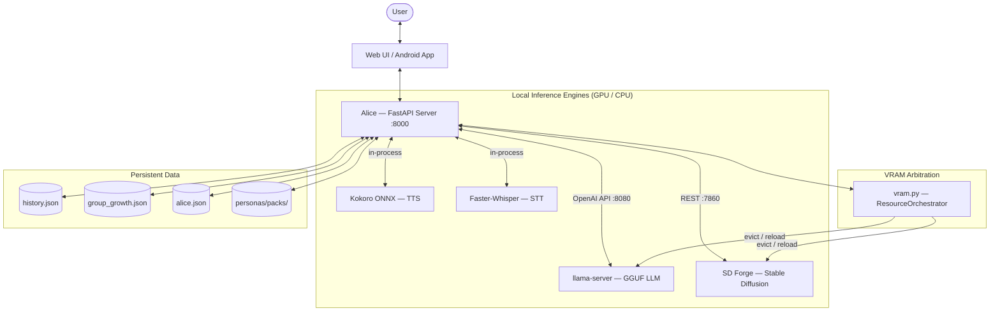
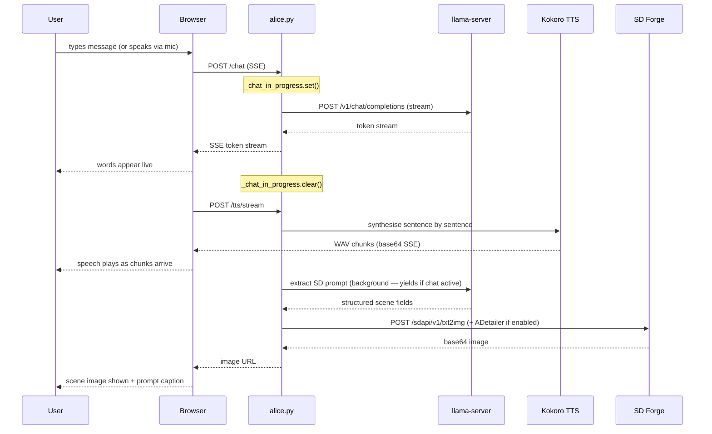
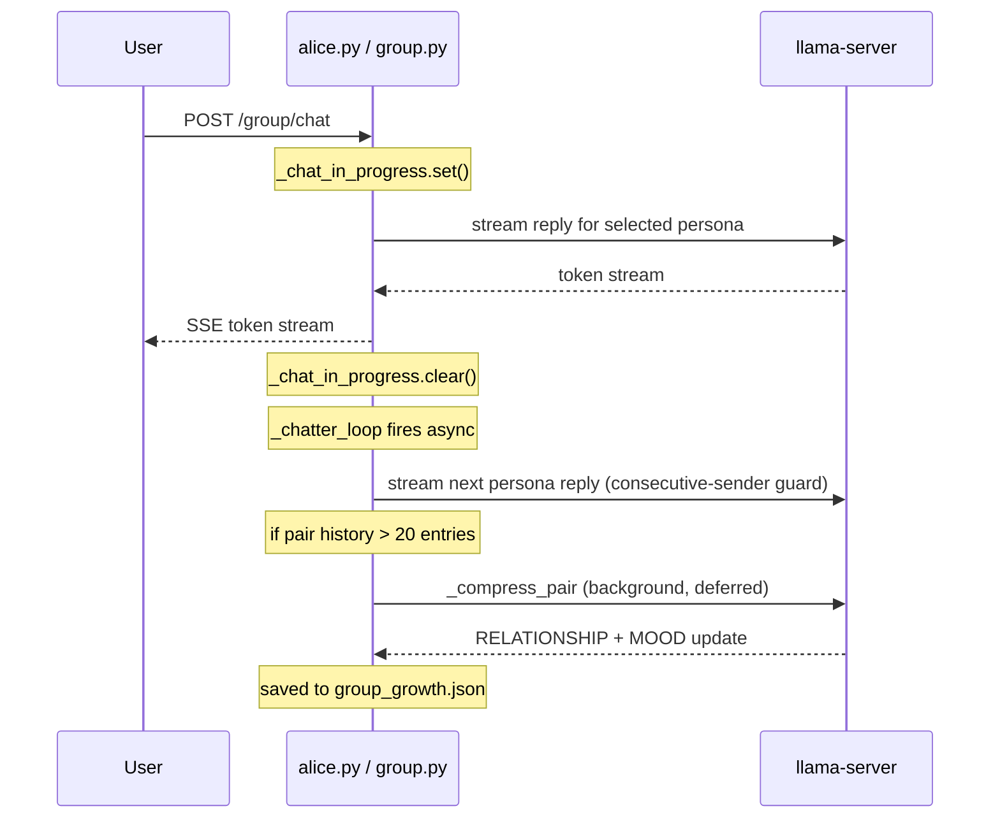
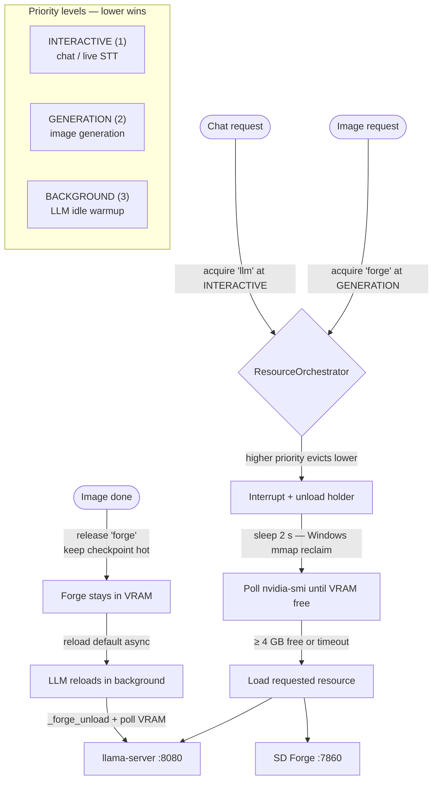
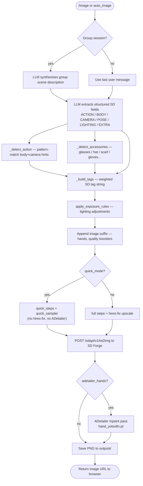
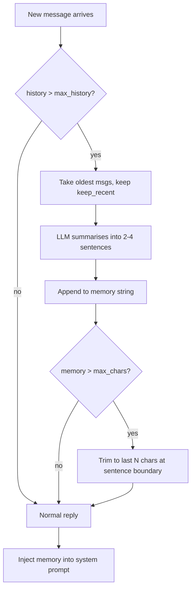

# Alice

A local AI companion with streaming chat, voice, mic input, and contextual image generation. Everything runs on your own hardware — no cloud, no API keys, no subscriptions.

Powered by:
- [llama.cpp](https://github.com/ggerganov/llama.cpp) — local LLM inference via OpenAI-compatible server (GGUF, GPU-accelerated)
- [Stable Diffusion WebUI Forge](https://github.com/lllyasviel/stable-diffusion-webui-forge) — image generation
- [Kokoro ONNX](https://github.com/thewh1teagle/kokoro-onnx) — offline neural TTS
- [faster-whisper](https://github.com/SYSTRAN/faster-whisper) — offline STT (Whisper small.en)



---

## System Requirements

| | Minimum | Recommended |
|---|---------|-------------|
| **OS** | Windows 10 / macOS 12 / Ubuntu 22.04 | Windows 11 / macOS 14 / Ubuntu 24.04 |
| **Python** | 3.10 | 3.11–3.13 |
| **Git** | Any | Latest |
| **RAM** | 16 GB | 32 GB |
| **VRAM** | 4 GB | 8 GB+ |
| **Disk** | 20 GB free | 40 GB free |
| **GPU** | NVIDIA or AMD (Vulkan) / Apple Silicon (Metal) | RTX 2070 / RX 6700 / M2 or better |

> CPU-only mode works but LLM inference will be slow.
> WSL2 on Windows 11 is also supported.

---

## Installation & Running

```
python alice.py [--auto-image] [--no-speech] [--persona=<name>]
```

That's it.

**CLI flags:**

| Flag | Effect |
|------|--------|
| `--auto-image` | Enable auto image generation on every chat turn (overrides `auto_every: 0` in config) |
| `--no-speech` | Disable TTS entirely |
| `--persona=<name>` | Start with a specific persona (partial name match supported) |

On first run, `alice.py` detects missing dependencies and runs `install.py` automatically before starting. On later runs it binds to the configured `port` from `alice.json`, terminating any stale listener already holding that port before retrying startup.

`install.py` performs 6 steps:

| Step | What | Size |
|------|------|------|
| 1 | Python version check | — |
| 2 | pip packages (`fastapi`, `uvicorn`, `kokoro-onnx`, `faster-whisper`, `av`, …) | ~500 MB |
| 3 | llama-server binary (platform-appropriate build) | ~50 MB |
| 4 | LLM model — scans for existing GGUFs, or downloads default from HuggingFace | ~7 GB |
| 5 | Kokoro TTS model and voices | ~80 MB |
| 6 | Stable Diffusion Forge (git clone) + checkpoint + ADetailer extension + hand model | ~5 GB |

**Total first-install time: 15–45 minutes** depending on connection and hardware. Subsequent starts take ~30–60 seconds.

You can also run `install.py` directly at any time to re-run setup or add missing components.

---

## Configuration

`install.py` creates `alice.json` from `server/conf/alice.example.json` on first run. `alice.json` is gitignored — it is your personal config.

Key settings:

| Key | Default | Description |
|-----|---------|-------------|
| `name` | `"Alice"` | Character name shown in UI |
| `port` | `8000` | FastAPI port for Alice itself; `ALICE_URL` is derived from this |
| `model_path` | `""` | Absolute path to a GGUF model file (set by `install.py`) |
| `llama_server_path` | `""` | Path to `llama-server` binary (set by `install.py`, auto-detected if blank) |
| `system_prompt` | *(see example)* | LLM system prompt / personality |
| `appearance` | *(see example)* | SD prompt fragment for consistent character appearance |
| `negative_prompt` | *(see example)* | SD negative prompt — includes weighted hand/finger anatomy terms |
| `stt_silence_seconds` | `3` | Seconds of mic silence before recording auto-stops |
| `tts.voice` | `"af_nicole"` | Kokoro voice ID |
| `tts.speed` | `0.85` | TTS speed multiplier |
| `tts.chunk_chars` | `600` | Max characters per TTS synthesis chunk |
| `image.steps` | `25` | Diffusion steps |
| `image.suffix` | *(see example)* | Appended to every SD prompt — includes `(perfect hands:1.3), (five fingers:1.2)` |
| `image.auto_every` | `0` | Generate an image every N chat turns (0 = disabled) |
| `image.adetailer_hands` | `false` | Run ADetailer hand-repair pass after each generation (requires ADetailer extension) |
| `image.hires_fix` | `true` | Enable hires fix upscale pass |
| `image.quick_steps` | `steps ÷ 2` | Steps used in QUICK mode (minimum 12) |
| `image.quick_sampler` | `"DPM++ 2M Karras"` | Sampler used in QUICK mode — DPM++ 2M Karras is ~2× faster than DPM++ SDE Karras (1 eval/step vs 2) with better quality than Euler |
| `quick_image` | `true` | QUICK mode toggle (persisted here, also controlled from the UI button) — skips hires fix, ADetailer, and group scene synthesis; uses `quick_steps`/`quick_sampler` |
| `forge_args` | *(platform default)* | Override Forge launch flags (e.g. `"--api --xformers"`) |
| `forge_venv_dir` | `""` | Optional path to an existing Forge virtualenv to reuse instead of creating `stable-diffusion-webui-forge/venv` |
| `sd_models_dir` | `"~/.cache/stable-diffusion/models"` | Extra directory Forge will search for SD checkpoints (passed as `--ckpt-dir`); mirrors the `~/.cache/lm-studio/models` pattern for LLMs |
| `llama_server.n_gpu_layers` | `24` | GPU layers offloaded to GPU. Reduce to lower VRAM use at the cost of slightly slower inference. See **VRAM budget** below. |
| `llama_server.ctx_size` | `2048` | Context window in tokens. 2048 is sufficient for normal conversation and halves KV-cache VRAM vs 4096. |
| `vram_swap_for_image` | `false` | Kill the LLM before each image gen to free VRAM, then restart it after. Only needed when `n_gpu_layers` is too high for both to coexist. See **VRAM budget** below. |
| `llama_url` | `"http://127.0.0.1:8080"` | llama-server URL (override with `LLAMA_URL` env var) |
| `memory.max_history` | `16` | Compress history after this many messages |
| `memory.keep_recent` | `8` | Messages kept after compression |
| `memory.max_chars` | `1500` | Max chars in rolling memory summary |
| `demo.user_name` | `"User"` | Name shown for the auto-generated user side in demo mode |
| `demo.user_voice` | `"am_adam"` | TTS voice for the user side (`am_adam`, `am_michael`, `bm_george`, `bm_lewis`) |
| `demo.user_speed` | `0.88` | TTS speed for the user voice |
| `demo.user_pitch` | `0.88` | Pitch multiplier for the user voice (< 1.0 = lower/deeper) |
| `demo.user_persona` | `"default"` | Active user persona key (must match a key in `user_personas`) |
| `demo.user_personas` | *(5 built-in)* | Dict of named persona descriptions — each shapes how the user-side messages are written |

Restart `alice.py` after editing `alice.json`.

## Logging

Runtime logs are written to `log/`, which is gitignored. The Python server writes to `log/python-server.log`, and Rust components can join the same directory via the shared `ALICE_LOG_DIR` / `ALICE_LOG_LEVEL` environment contract.

Check `log/` first for startup failures, uncaught exceptions, and Forge connectivity errors.

---

## GPU Compatibility

`install.py` downloads the platform-appropriate `llama-server` binary automatically:

| Platform | GPU | Build |
|----------|-----|-------|
| Windows | NVIDIA or AMD | Vulkan (universal) |
| Windows fallback | CPU only | AVX2 |
| macOS Apple Silicon | Metal (auto) | arm64 |
| macOS Intel | Metal (auto) | x64 |
| Linux / WSL2 | NVIDIA CUDA | Ubuntu x64 |
| Linux fallback | CPU only | Ubuntu x64 |

Stable Diffusion Forge launch flags are set per-platform automatically and can be overridden via `forge_args` in `alice.json`:
- **Windows** — `--api --cuda-malloc --xformers`
- **macOS** — `--api --skip-torch-cuda-test` (Metal via MPS)
- **Linux / WSL2** — `--api --xformers`

Forge requires Python 3.10 or 3.11 for its virtualenv. `install.py` finds it automatically from PATH, Homebrew, or pyenv.
If you already have a working Forge virtualenv elsewhere, set `forge_venv_dir` in `alice.json` and Alice will pass that path through as Forge's `VENV_DIR`.

---

## LLM Model

Alice uses a GGUF model served by `llama-server` via the OpenAI-compatible API.

**Auto-detection order (during `install.py`):**

1. `model_path` already set in `alice.json`
2. Existing `.gguf` files in `models/`, `~/.cache/lm-studio/models/`, or GPT4All directory
3. Downloads `bartowski/dolphin-2.9.4-mistral-nemo-12b-GGUF` (Q4_K_M, ~7 GB) from HuggingFace

**Recommended models:**

| Model | Size | Notes |
|-------|------|-------|
| `bartowski/dolphin-2.9-llama3-8b-Q4_K_M` | 4.9 GB | Best quality for 8 GB cards — use with `vram_swap_for_image: true` |
| `bartowski/Llama-3.2-3B-Instruct-abliterated-Q4_K_M` | 2.2 GB | Smallest viable; fits alongside Forge without swapping |
| `bartowski/dolphin-2.9.4-gemma2-2b-Q4_K_M` | 1.7 GB | Ultra-small fallback |

> The Dolphin fine-tune series follows the ChatML format and honours system prompts reliably. Instruction-tuned base models (Mistral-Instruct, Llama-3-Instruct) may override system prompt directives due to RLHF alignment training.

To use a different model: set `model_path` in `alice.json` and restart.

### VRAM budget

Alice runs the LLM and Forge simultaneously. Both must fit in your GPU's VRAM or image generation will stall.

**Rule of thumb for 8 GB GPUs (e.g. RTX 2070):**

| Model | `n_gpu_layers` | `vram_swap_for_image` | LLM VRAM | + Forge idle | Result |
|---|---|---|---|---|---|
| 8B Q4_K_M | 99 (all) | **true** | ~5 GB | ~2 GB | ✓ best quality — LLM suspends during image gen |
| 7B Q4_K_M | 99 (all) | false | ~4.5 GB | ~2 GB | ✓ fits — coexist mode |
| 3B Q4_K_M | 99 (all) | false | ~2.2 GB | ~2 GB | ✓ safe — lowest quality |
| 8B Q4_K_M | 99 (all) | false | ~5 GB | ~3.5 GB | ✗ OOM during generation |

**`vram_swap_for_image: true`** — Alice suspends llama-server before each image generation (freeing its VRAM), then restarts it afterwards. Required for 8B models on 8 GB GPUs. The LLM reloads in the background; chat becomes available again as soon as it's ready. Adds ~30–60 s per image on the first request after a chat (subsequent images while the LLM is already suspended are instant).

The **Model** dropdown in the header shows all discovered GGUF files with their size in GB. Selecting a different model hot-reloads the llama-server without restarting Alice.

---

## SD Checkpoint

The **SD Checkpoint** dropdown in the header lists all checkpoints known to Forge. Selecting one loads it immediately (takes 10–30 s depending on the model size). The selection is persisted in `alice.json` (`sd_checkpoint`).

To make extra checkpoint directories visible to Forge, set `sd_models_dir` in `alice.json` (e.g. `"~/.cache/stable-diffusion/models"`). Alice passes this as `--ckpt-dir` when it starts Forge.

---

## Personas

Switch between different groups of personas using the dropdown in the header. History is preserved across switches — a styled divider marks the transition. The SD checkpoint, TTS voice, and UI font switch automatically. The last reply is re-spoken with the new persona's voice immediately after switching.

Main persona's opening line is randomly chosen from a pool of 12 variations on each page load and after clearing history.

Add your own in `personas.json` (created from `conf/personas.example.json` on first run):

```json
{
    "Dick Tracy": {
        "system_prompt": "You are a hard-boiled detective ...",
        "appearance": "man, dark hair, trench coat, film noir lighting"
    }
}
```

Per-persona options: `system_prompt`, `appearance`, `negative_prompt` (appended to base), `tts` (`voice`, `speed`, `effects`), `image` (`suffix`, `steps`, `cfg_scale`, …), `sd_model`, `name`.

To remove a persona from the UI (including the Group Chat picker), add `"disabled": true` to its entry in `personas.json`:

```json
{
    "Dick Tracy": { "disabled": true }
}
```

This also works to suppress the built-in default Alice persona.

---

## Group Chat

Multiple personas can share a single conversation, respond to each other, and remember their relationships over time.

### Starting a group session

From the UI, select **Group** and choose which personas to include. All selected personas join the same conversation thread. The user can send messages at any time; between user turns the personas continue chatting with each other automatically via a background chatter loop.

From the API:

```
POST /group/start   {"personas": ["Dick Tracy", "Freddy Four Fingers", "Joe the Cop"]}
POST /group/chat    {"message": "Tell me what you all think of each other."}
GET  /group/history
POST /group/stop
```

### How the chatter loop works

After each user message (and after each AI turn), an async `_chatter_loop` task selects the next speaker and generates a reply. Speaker selection:

1. A persona is chosen at random from the active group.
2. The consecutive-sender guard ensures the same persona never speaks twice in a row — if the random pick matches the last speaker, a different one is selected.
3. The selected persona sees only its own per-pair conversation history with each other persona, so context stays focused and doesn't bloat.

### Repetition suppression

The group system actively fights repetition at three levels:

| Mechanism | What it does |
|-----------|-------------|
| **Consecutive-sender guard** | Re-rolls speaker selection if the same persona would speak twice in a row |
| **Phrase avoidance** | Extracts 4-grams appearing 2+ times AND single content words (e.g. "moonlight", "whispers") appearing 3+ times; injects an explicit `AVOID these stale phrases:` list into the system prompt |
| **Near-duplicate deduplication** | Before building the LLM context, `_dedupe_entries` strips any turn with Jaccard similarity > 0.65 against a recent turn, and caps same-sender streaks at 2 consecutive turns |

### Persona growth

Each persona pair maintains a persistent **relationship memo** and **emotional state** that survive server restarts.

- After every 20 exchanges between a pair, a background LLM call (`_compress_pair`) generates a structured update:
  - `RELATIONSHIP:` — 2–3 sentence summary of how the pair's dynamic has evolved
  - `<NAME>_MOOD:` — current emotional state for each persona
- These are saved to `group_growth.json` and injected into each persona's system prompt on subsequent turns:
  ```
  Your history with Morrigan: They share a wary respect...
  Your current emotional state: guarded but intrigued
  ```
- Growth data persists across sessions. The relationship continues deepening even after restarting the server.

### Group scene image generation

When `/image` is called during a group session, the image pipeline handles multi-persona scenes specially:

1. **Scene synthesis** — a dedicated LLM call converts the purple-prose group history into a concrete physical description ("Two women stand facing each other in a moonlit forest clearing…"). This gives the SD prompt extractor grounded visual content to work from.
2. **Meta-instruction detection** — if the user's last message was a generation command rather than a physical action ("show me a group shot", "generate an image of all of them"), the synthesised scene is used as the action context instead of the literal user message.
3. **Setting inference** — keyword patterns in each persona's system prompt and appearance tags are matched against known settings (forest, Victorian parlor, dungeon, etc.) and injected as a `SCENE SETTING` hint for the SD prompt extractor.
4. **Per-persona appearance tags** — each persona in the scene gets a weighted appearance block `(1woman, <appearance tags>:1.2)` so Stable Diffusion renders them as distinct individuals.

---

## Conversation Memory

Alice maintains a rolling memory so long conversations don't lose earlier context:

- **History** is saved to `history.json` after each reply and reloaded on startup.
- When history exceeds **16 messages**, the oldest 8 are summarised by the LLM into a brief paragraph stored as `memory`.
- That memory paragraph is prepended to the system prompt on every subsequent request.
- The memory buffer is capped at **1500 characters** and trimmed at the nearest sentence boundary to avoid cutting mid-sentence.

**Why 1500 characters?** The memory string is injected into every system prompt, counting against the context window. With the default `ctx_size = 4096` tokens, ~375 tokens (≈ 1500 chars) is a safe budget. If you increase `ctx_size`, raise `memory.max_chars` proportionally in `alice.json`.

- **Reset** — the Reset dropdown (header, far right) lets you pick which persona to reset; selecting one wipes that persona's history, memory, and `history.json`.
- Memory is also cleared when switching personas or models.

---

## Using Alice

### Chat

Type a message and press **Enter**. Alice streams her reply word-by-word, speaks it aloud, then generates a contextual image.

Press **ESC** or click **Stop** to interrupt at any time — Stop is always enabled and halts TTS, STT recording, chat streaming, and image generation simultaneously. Messages are capped at 4000 characters.

### Microphone (push-to-talk)

Click **Mic** to start recording. Click again to stop manually, or wait for the silence auto-stop (default 3 seconds, configurable via `stt_silence_seconds`).

The small arrow next to the Mic button opens a device selector — your chosen device is remembered across sessions.

After recording, Alice transcribes and sends automatically.

### Voice (TTS)

Alice speaks every reply using Kokoro neural TTS. Speech is streamed sentence-by-sentence — the first sentence plays while the rest is still being synthesised.

| Control | Action |
|---------|--------|
| Stop / **Esc** | Halt TTS, STT, chat, and image generation immediately |
| Mute / **M** | Toggle voice on/off (keyboard only) |
| Re-say / **R** | Replay the last spoken reply (keyboard only — no re-synthesis) |

**Keyboard shortcuts** (when the text input is not focused):

| Key | Action |
|-----|--------|
| `M` | Toggle mute |
| `R` | Re-say last reply |
| `Delete` | Delete current image |
| `Esc` | Stop / interrupt |

Available voices: `af_nicole`, `af_bella`, `af_sarah`, `af_sky` (American female) · `am_adam`, `am_michael` (American male) · `bf_emma`, `bf_isabella` (British female) · `bm_george`, `bm_lewis` (British male). Each persona sets its own default voice; the dropdown overrides it for the session.

### Image panel

The right panel shows the generated scene image. Below the image a **prompt caption** shows the SD tags that produced the current image. Click the caption (or the **+** button) to open the prompt editor — edit the extracted prompt, adjust Steps/CFG sliders, and click **Regenerate**.

Press **Delete** while an image is active to remove it from disk and history.

Thumbnail strip at the side shows the session's image history. Click any thumbnail to view it and load its prompt. Hover for the SD prompt and timestamp.

Expand **Negative prompt** at the bottom of the editor to inspect the active negative prompt.

### Image quality — hands and fingers

The default negative prompt includes explicit wrong-count penalties (`(six fingers:1.9)`, `(seven fingers:1.9)`, etc.) and the image suffix includes `(perfect hands:1.3), (five fingers:1.2)`.

For the best hand quality, enable ADetailer post-processing in `alice.json`:

```json
"image": {
    "adetailer_hands": true
}
```

ADetailer runs a second inpaint pass targeting detected hands using `hand_yolov8n.pt`. The extension and model are installed automatically by `install.py`.

### Accessories

Alice will wear accessories mentioned in your message. Recognised terms:

| Mentioned | SD tag added |
|-----------|-------------|
| glasses / spectacles | `(wearing glasses:1.3)` |
| sunglasses | `(wearing sunglasses:1.3)` |
| hat / cap / beret | `(wearing hat:1.3)` |
| etc... | ... |

### Seed pinning

The 🔒 button pins the current seed, locking the face/character design across subsequent generations. Click again or use `/seed/unpin` to return to random seeds.

### Manual image generation

Use the **Image** button or type a command:

```
/image
/image backstreet, raining, neon glow
/image no blur
/auto-image
```

Prefix a token with `no ` to push it to the negative prompt. All other tokens are prepended to the positive prompt.

`/auto-image` toggles automatic image generation on/off for the session (same as `--auto-image` at startup). The input placeholder briefly shows `Auto-image ON` or `Auto-image OFF` as confirmation.

### Group chat

Click **Group** in the header to open the group session panel. Select two or more personas and click **Start**. The personas will begin conversing with each other; type a message at any time to join in.

The chatter loop runs automatically between your messages. Each persona remembers its relationship with every other — these memories accumulate in `group_growth.json` and persist across sessions.

Images generated during a group session capture the full scene: all active personas are included, their appearances are kept visually distinct, and the physical setting is inferred from the conversation context.

### Demo mode

**Demo** puts Alice on autopilot — the system generates both sides of the conversation, speaks them, and generates images, indefinitely.

Click **Demo** to start. The button shows the current turn count (`Demo: ON (4)`). Click again or press **Stop** to end.

The **Type dropdown** (left of the Demo button) controls how the generated user-side messages are written. Five personas are built in (`default`, `intellectual`, `dominant`, `romantic`, `playful`); add your own in `alice.json` under `demo.user_personas`.

The user side is spoken in a separate male voice (`am_adam` by default) with independent speed and pitch settings, both configurable in `alice.json`. Demo pauses for a random 1.5–4s between turns and builds conversational intensity across a five-stage arc (opening → warming up → building → sustained → deeply connected). Typing into the chat input or clicking Stop ends the demo immediately.

### Model switcher

The leftmost dropdown lists models available from the llama-server. Switching clears history and forces model re-detection on the next request.

---

## Directory Structure

The repository is organized by runtime environment: a thin root launcher delegates to the Python backend, while the Rust core provides native performance for desktop and mobile bindings.

```
alice/
├── alice.py                  ← thin root launcher (delegates to server/alice.py)
├── install.py                ← installer orchestrator
│
├── server/                   ← Python backend (FastAPI)
│   ├── alice.py              ← backend entry point & startup logic
│   ├── config.py             ← paths, defaults, persona merging
│   ├── llm.py                ← llama-server lifecycle, history, memory compression
│   ├── state.py              ← shared runtime state (appearance, seed, active persona)
│   ├── tts.py                ← Kokoro TTS synthesis & sentence streaming
│   ├── stt.py                ← Faster-Whisper transcription
│   ├── utils.py              ← shared helpers (logging, path resolution, OS checks)
│   │
│   ├── routes/               ← FastAPI endpoint modules
│   │   ├── chat.py           ← /chat (SSE streaming)
│   │   ├── group.py          ← /group/* (group chat, chatter loop, growth)
│   │   ├── audio.py          ← /voices, /tts, /stt
│   │   ├── image_api.py      ← /image, /reroll, /generate, /seed
│   │   ├── persona.py        ← /personas, /persona/{name}
│   │   └── system.py         ← /info, /history, /models, /settings, /demo/*
│   │
│   ├── image/                ← image generation package
│   │   ├── prompt.py         ← SD tag utilities, LLM prompt extraction
│   │   ├── forge.py          ← Forge process lifecycle
│   │   └── generate.py       ← txt2img API calls & ADetailer handling
│   │
│   ├── installer/            ← modular installer steps
│   │   ├── packages.py       ← dependency & pip checks
│   │   ├── llama.py          ← llama-server binary retrieval
│   │   ├── model.py          ← GGUF model selection & download
│   │   ├── tts_install.py    ← Kokoro model & voice retrieval
│   │   └── forge_install.py  ← SD Forge & ADetailer setup
│   │
│   ├── static/               ← Web UI (HTML/CSS/JS)
│   │   └── outputs/          ← generated images (gitignored)
│   │
│   └── tests/                ← pytest suite (247+ tests)
│
├── core/                     ← Rust core (native inference)
│   ├── src/                  ← cross-platform engine logic (LLM, TTS, STT)
│   └── bindings/
│       ├── python/           ← pyo3 bindings (future desktop native path)
│       └── android/          ← JNI bindings for the Android app
│
├── android/                  ← Android application (Kotlin/Jetpack Compose)
│   └── app/src/main/java/    ← UI, ViewModels, and JNI bridge to Rust core
│
├── personas/                 ← persona management
│   ├── packs/                ← shared persona sets (git-tracked)
│   │   ├── philosopers.json  ← Philosophers spanning 23 centuries
│   │   └── senate.json       ← the Roman Senate expansion pack
│   └── mine/                 ← personal customizations & backups (gitignored)
│
├── log/                      ← runtime logs (gitignored)
├── models/                   ← GGUF and TTS models (gitignored)
├── llama-cpp/                ← llama-server binaries (gitignored)
└── stable-diffusion-webui-forge/  ← SD Forge checkout (gitignored)
    ├── extensions/adetailer/ ← ADetailer extension (auto-cloned)
    └── models/adetailer/     ← hand_yolov8n.pt (auto-downloaded)
```

---

## Android App (Experimental)

Alice includes a native Android application located in `android/`. This app is designed for fully local, private AI interaction on high-end mobile devices.

- **Local Inference:** Uses the Rust `core` via JNI bindings.
- **Hardware Acceleration:** Leverages mobile GPUs for both LLM and TTS.
- **Status:** Experimental. Currently supports streaming chat and voice synthesis. Image generation still requires the Python backend or a future mobile-native diffusion implementation.

To build, open the `android/` directory in Android Studio. Ensure the Rust toolchain is installed to compile the `alice-core` native library.

---

## Repetition Suppression

Alice fights conversational staleness through multiple dynamic and static mechanisms.

### Banned Phrases (Static)
The `banned_phrases` list in `alice.json` lets you permanently block specific clichés. These are injected into every system prompt as a hard constraint.

```json
"banned_phrases": [
    "moonlight", "as an AI", etc
]
```

### Dynamic Suppression
The system actively monitors the current session for repetition:
- **N-gram blocking:** Automatically identifies and bans 2-4 word phrases that appear too frequently.
- **Phrase avoidance:** Detects overused content words and injects an `AVOID` list into the LLM context.
- **Jaccard deduplication:** Re-rolls or strips turns that are too similar (> 65% overlap) to recent messages.

---

## Personas & Growth

History is preserved across persona switches, but each character maintains its own unique perspective.

### Persona Reset
The **Reset** option in the UI (or `DELETE /persona/{name}/reset`) performs a deep wipe:
1. Clears chat history and memory for that persona.
2. Wipes **Growth Data** — relationship memos and emotional states stored in `group_growth.json`.
3. Resets character-specific appearance and image state.

This effectively "reboots" your relationship with that persona while leaving others untouched.

---

## Persona Packs

Alice supports modular persona sets via the **Packs** dropdown in the header.

### Directory Structure
- **`personas/packs/`**: Shared, community persona sets included in the repository. (e.g., `senate.json`).
- **`personas/mine/`**: Your personal customizations. Files placed here will appear in the dropdown with a `mine/` prefix and are **never committed to Git**.
- **`personas.json`**: The active persona list. This is always a copy of a pack.

### Non-Destructive Switching
When you select a new pack from the UI:
1. The server automatically creates a timestamped backup of your current `personas.json` in `personas/mine/` (e.g., `backup_20260323_224512.json`).
2. The selected pack is copied to `personas.json`.
3. The UI reloads instantly with the new characters, fonts, and voices.

This ensures you can experiment with new persona sets (like the **Roman Senate** pack) without losing your tailored configurations.

### Default  Packs

#### The Philosophers (philosophers.json)
Six thinkers across twenty-three centuries who disagree about almost everything. Socrates asks questions that dismantle certainties. Nietzsche hammers idols. Diogenes dismisses the entire exercise and eats lunch. De Beauvoir is the sharpest mind in the room and has no patience for bad faith. Spinoza proves things geometrically and finds the drama baffling. William James wants to know what actually works.
Group chat puts them in direct conversation. The dynamics are immediate and unstable in exactly the right way.

#### The Roman Senate (senate.json)
Rome at the moment it is about to break. Caesar is charming and dangerous. Cicero uses ten words where one would do and is usually right. Cato is incorruptible and impossible. Mark Antony is the soldier everyone underestimates. Servilia moves through the shadows pulling strings no one else can see. Fulvia acts without asking permission.
Six people who shaped the ancient world, three of whom will be dead within a decade of where this conversation is set.

---

## Ports

| Port | Service |
|------|---------|
| `alice.json.port` (default `8000`) | Alice (FastAPI) |
| `alice.json.forge_url` (default `7860`) | Stable Diffusion Forge — Alice automatically injects `--port` from `forge_url` when starting Forge, so changing `forge_url` is all you need |
| 8080 | llama-server (OpenAI-compatible API) |

---

## Architecture

### Module structure

```mermaid
graph TD
    subgraph App ["alice.py — entry point"]
        Routes["FastAPI routes — /chat /image /tts /stt …"]
        Group["group.py — /group/chat · chatter loop · growth"]
    end

    subgraph Core ["Core modules"]
        Config["config.py — paths · defaults · personas"]
        LLM["llm.py — llama-server · chat · history · memory · priority flag"]
        State["state.py — appearance state · seed · active persona"]
        TTS["tts.py — Kokoro load + synthesis + effects"]
        STT["stt.py — Whisper load + transcription"]
        VRAM["vram.py — ResourceOrchestrator · VRAM arbitration"]
        Utils["utils.py — step · ok · warn · http_ok · is_wsl"]
    end

    subgraph ImagePkg ["image/ package"]
        Prompt["prompt.py — extract_sd_prompt · accessory detection"]
        Forge["forge.py — start_forge · set_forge_model"]
        Generate["generate.py — generate_image · ADetailer · appearance handling"]
    end

    subgraph InstallPkg ["installer/ package"]
        Helpers["helpers.py — Spinner · _download · constants"]
        Steps["packages · llama · model · tts_install · forge_install"]
    end

    subgraph External ["External processes (GPU)"]
        LlamaServer["llama-server :8080 — OpenAI-compatible API"]
        ForgeProc["SD Forge :7860 — Stable Diffusion"]
    end

    subgraph Persist ["Persistent data"]
        Growth["group_growth.json — memos · moods"]
        HistGroup["history_group_*.json — per-pair histories"]
    end

    Routes --> Config
    Routes --> LLM
    Routes --> State
    Routes --> TTS
    Routes --> STT
    Routes --> VRAM
    Routes --> ImagePkg
    Group --> LLM
    Group --> Config
    Group --> Growth
    Group --> HistGroup
    ImagePkg --> LLM
    ImagePkg --> State
    ImagePkg --> Utils
    LLM --> Utils
    LLM --> LlamaServer
    VRAM --> LlamaServer
    VRAM --> ForgeProc
    Forge --> ForgeProc
    Generate --> ForgeProc
    Steps --> Helpers
```



### Request flow — chat turn



> **LLM non-contention:** `_chat_in_progress` is a `threading.Event` held for the full lifetime of any streaming chat call. Background LLM callers (SD prompt extraction, pair compression, scene synthesis) use `llm_chat_deferred()`, which raises immediately if the flag is set rather than queuing behind the stream. This keeps chat responsive at all times.

### Request flow — group chat turn



### Startup sequence


### VRAM arbitration

Active only when `vram_swap_for_image: true`. The `ResourceOrchestrator` in `vram.py` manages GPU ownership via a priority system so the LLM and Forge never race for VRAM.



> **Keep-hot optimisation:** after image generation, the Forge checkpoint stays in VRAM instead of being evicted. This saves ~15 s on the next image request. The LLM is evicted lazily when it actually needs to load, and `_wait_vram_free()` polls `nvidia-smi` instead of sleeping a fixed 2 s.

### Image generation pipeline



### Memory compression



---

## Testing

From the repo root:

```
python -m pytest server/tests -v --ignore=server/tests/test_install.py
```

```powershell
cd core
$env:PYO3_USE_ABI3_FORWARD_COMPATIBILITY='1'
cargo test -p alice-core -p alice-core-python
```

Coverage includes config loading, image tag utilities, SD prompt extraction and accessory detection, installer asset selection, TTS effects, audio markdown cleaning, LLM history operations and memory compression, state utilities, API endpoints, VRAM orchestration, shared logging bootstrap, and Forge-unavailable error handling. No external services are required — heavy dependencies are stubbed in `server/tests/conftest.py`.

---

## Troubleshooting

### "Run install.py first" on startup
Dependencies are missing. Run `python install.py`.

### No sound / TTS disabled
Look for `WARNING: TTS models not found — run install.py` in the terminal. Run `install.py` to download Kokoro files.

### LLM server not connecting
- Check that `llama_server_path` and `model_path` are set correctly in `alice.json`
- Alice retries in the background for up to 2 minutes after startup
- You can also start `llama-server` manually and set `LLAMA_URL` env var

### Out of VRAM
- Reduce `llama_server.n_gpu_layers` in `alice.json` (try 20 or lower)
- Reduce image `width`/`height` to 512×512
- Use a smaller quantised model (Q4\_K\_S instead of Q4\_K\_M)

### Images not generating
- Visit `http://localhost:7860` — Forge should be running
- Forge starts in a separate console window; check it for errors
- Forge auto-restarts on the next image request if it died
- If Alice reports `Forge is unavailable at ...`, verify `forge_url` in `alice.json` and inspect `log/python-server.log`
- If Forge's local venv is broken but another checkout already works, set `forge_venv_dir` in `alice.json` to reuse that existing virtualenv

### Model ignores system prompt / breaks character
The LLM is not following the configured `system_prompt`. This typically means a heavily instruction-tuned base model is loaded — RLHF alignment can override custom system prompts. Switch to a model from the Dolphin series, which is specifically fine-tuned to respect system prompt directives. See **Recommended models** above.

### Forge starts but images still fail / dropdown empty
Check that `forge_url` uses the correct port. Alice starts Forge with `--port` derived from `forge_url`, but if Forge was already running on a different port it won't respond. Kill the stale Forge process and restart Alice, or point `forge_url` at the port Forge is actually listening on.

### ADetailer error on image generation
- Ensure the ADetailer extension is present in `stable-diffusion-webui-forge/extensions/adetailer/`
- Run `python install.py` to clone it automatically
- If the error persists, set `"adetailer_hands": false` in `alice.json` to disable it

### Forge fails to start
- Forge requires Python 3.10 or 3.11 — install via `brew install python@3.11` or `apt install python3.11`
- On Windows, try reusing a known-good Forge venv with `forge_venv_dir`
- On macOS, Forge uses Metal (MPS) automatically — no CUDA needed
- Override launch flags via `forge_args` in `alice.json` if needed

### WSL2 (Windows Subsystem for Linux)
- The browser opens automatically via `explorer.exe`
- If `localhost:8000` doesn't load in your Windows browser, use the WSL2 IP printed at startup
- For GPU acceleration, install the [NVIDIA CUDA WSL2 driver](https://developer.nvidia.com/cuda/wsl) on the Windows host

### Whisper transcribes nothing / "Could not hear anything"
- Check the mic device selector next to the Mic button
- Ensure the correct input device is selected and not muted in system sound settings
