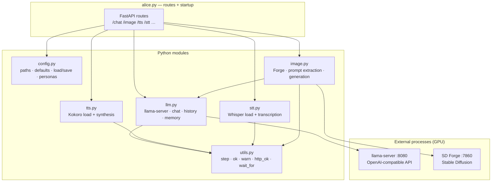
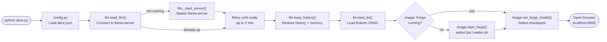
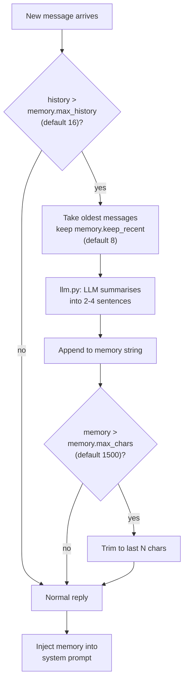

# Alice

> **⚠️ NSFW / 18+ — This project generates adult content. You must be 18 or older to use it.**

A local AI companion with streaming chat, voice, mic input, and contextual image generation. Everything runs on your own hardware — no cloud, no API keys, no subscriptions.

Powered by:
- [llama.cpp](https://github.com/ggerganov/llama.cpp) — local LLM inference via OpenAI-compatible server (GGUF, GPU-accelerated)
- [Stable Diffusion WebUI Forge](https://github.com/lllyasviel/stable-diffusion-webui-forge) — image generation
- [Realistic Vision V5.1](https://huggingface.co/SG161222/Realistic_Vision_V5.1_noVAE) — default image checkpoint (auto-downloaded)
- [Kokoro ONNX](https://github.com/thewh1teagle/kokoro-onnx) — offline neural TTS
- [faster-whisper](https://github.com/SYSTRAN/faster-whisper) — offline STT (Whisper small.en)

---

## System Requirements

| | Minimum | Recommended |
|---|---------|-------------|
| **OS** | Windows 10 | Windows 11 |
| **Python** | 3.10 | 3.11–3.13 |
| **Git** | Any | Latest |
| **RAM** | 16 GB | 32 GB |
| **VRAM** | 4 GB | 8 GB+ |
| **Disk** | 20 GB free | 40 GB free |
| **GPU** | NVIDIA or AMD (Vulkan) | RTX 2070 / RX 6700 or better |

> CPU-only mode works but LLM inference will be slow.

---

## Installation

Run once:

```
python install.py
```

This performs 6 steps:

| Step | What | Size |
|------|------|------|
| 1 | Python version check | — |
| 2 | pip packages (`fastapi`, `uvicorn`, `kokoro-onnx`, `faster-whisper`, `av`, …) | ~500 MB |
| 3 | llama-server binary (Vulkan build on Windows) | ~50 MB |
| 4 | LLM model — scans for existing GGUFs, or downloads default from HuggingFace | ~7 GB |
| 5 | Kokoro TTS model and voices | ~80 MB |
| 6 | Stable Diffusion Forge (git clone) + Realistic Vision V5.1 checkpoint | ~5 GB |

**Total first-install time: 15–45 minutes** depending on connection and hardware.

---

## Running

```
python alice.py
```

Opens at `http://localhost:8000`. Subsequent starts take ~30–60 seconds.

`alice.py` assumes `install.py` has been run. If dependencies are missing it exits with a clear message.

---

## Configuration

`install.py` creates `alice.json` from `alice.json.example` on first run. `alice.json` is gitignored — it is your personal config.

Key settings:

| Key | Default | Description |
|-----|---------|-------------|
| `name` | `"Alice"` | Character name shown in UI |
| `model_path` | `""` | Absolute path to a GGUF model file (set by `install.py`) |
| `llama_server_path` | `""` | Path to `llama-server` binary (set by `install.py`, auto-detected if blank) |
| `system_prompt` | *(see example)* | LLM system prompt / personality |
| `appearance` | *(see example)* | SD prompt fragment for consistent character appearance |
| `stt_silence_seconds` | `3` | Seconds of mic silence before recording auto-stops |
| `tts.voice` | `"af_nicole"` | Kokoro voice ID |
| `tts.speed` | `0.85` | TTS speed multiplier |
| `image.auto_every` | `1` | Generate an image every N chat turns (0 = disabled) |
| `llama_server.n_gpu_layers` | `33` | GPU layers offloaded — reduce if you get VRAM OOM |
| `llama_server.ctx_size` | `2048` | Context window in tokens — increase for longer memory |
| `llama_url` | `"http://127.0.0.1:8080"` | llama-server URL (override with `LLAMA_URL` env var) |
| `memory.max_history` | `16` | Compress history after this many messages |
| `memory.keep_recent` | `8` | Messages kept after compression |
| `memory.max_chars` | `1500` | Max chars in rolling memory summary — scale with `ctx_size` |

Restart `alice.py` after editing `alice.json`.

---

## GPU Compatibility

`install.py` downloads the platform-appropriate `llama-server` binary automatically:

| Platform | GPU | Build |
|----------|-----|-------|
| Windows | NVIDIA or AMD | Vulkan (universal) |
| Windows fallback | CPU only | AVX2 |
| macOS Apple Silicon | Metal | arm64 |
| macOS Intel | Metal | x64 |
| Linux | NVIDIA/CPU | Ubuntu x64 |

---

## LLM Model

Alice uses a GGUF model served by `llama-server` via the OpenAI-compatible API.

**Auto-detection order (during `install.py`):**

1. `model_path` already set in `alice.json`
2. Existing `.gguf` files in `models/`, `~/.cache/lm-studio/models/`, or GPT4All directory
3. Downloads `bartowski/dolphin-2.9.4-mistral-nemo-12b-GGUF` (Q4_K_M, ~7 GB) from HuggingFace

**Recommended models:**

| Model | VRAM | Size | Notes |
|-------|------|------|-------|
| `dolphin-2.9.4-mistral-nemo-12b-Q4_K_M` | 8 GB | ~7 GB | Default — good balance |
| `Mistral-7B-Instruct-v0.3-uncensored-Q4_K_M` | 6 GB | 4.4 GB | Lighter option |
| `Llama-3-8B-Lexi-Uncensored-Q4_K_M` | 8 GB | 4.9 GB | Alternative 8B |

To use a different model: set `model_path` in `alice.json` and restart.

---

## Personas

Create a `personas.json` file to define named personas. Switch between them using the dropdown in the header. Switching clears history and memory.

```json
{
    "Noir": {
        "system_prompt": "You are a hard-boiled detective ...",
        "appearance": "woman, dark hair, trench coat, film noir lighting"
    }
}
```

---

## Conversation Memory

Alice maintains a rolling memory so long conversations don't lose earlier context:

- **History** is saved to `history.json` after each reply and reloaded on startup.
- When history exceeds **16 messages**, the oldest 8 are summarised by the LLM into a brief paragraph and stored as `memory`.
- That memory paragraph is prepended to the system prompt on every subsequent request.
- The memory buffer is capped at **1500 characters** by default.

**Why 1500 characters?** The memory string is injected directly into every system prompt, which counts against the context window. With the default `ctx_size = 2048` tokens, roughly 375 tokens (≈ 1500 chars at 4 chars/token) is a safe budget that leaves room for the system prompt itself, recent history, and the user's message. If you increase `ctx_size` — e.g. to 4096 or 8192 — raise `memory.max_chars` proportionally in `alice.json`.

- **Clear** — the Clear button wipes history, memory, and `history.json`.
- Memory is also cleared when switching personas or models.

---

## Using Alice

### Chat

Type a message and press **Enter**. Alice streams her reply word-by-word, speaks it aloud, then generates a contextual image.

Press **ESC** or click **Stop** to interrupt at any time.

### Microphone (push-to-talk)

Click **Mic** to start recording. Click again to stop manually, or wait for the silence auto-stop (default 3 seconds, configurable via `stt_silence_seconds` in `alice.json`).

The small arrow next to the Mic button opens a device selector — your chosen device is remembered across sessions.

After recording, Alice transcribes and sends automatically.

### Voice (TTS)

Alice speaks every reply using Kokoro neural TTS.

| Control | Action |
|---------|--------|
| Voice dropdown | Switch TTS voice instantly |
| Mute | Toggle voice on/off |
| Re-say | Replay the last spoken reply |

Available voices: `af_nicole` (breathy), `af_bella`, `af_sky`, `bf_emma` (British), `bf_isabella`.

### Image panel

The right panel shows the generated scene. Click **+** to open the prompt editor — edit the extracted SD prompt, adjust Steps/CFG sliders, and click **Regenerate**.

### Manual image generation

Use the **Image** button or type a command:

```
/image
/image candlelight, close up, warm glow
```

### Model switcher

The leftmost dropdown lists models available from the llama-server. To add models, set `model_path` in `alice.json` and restart.

---

## Directory Structure

```
alice/
├── alice.py          ← FastAPI routes + startup (imports modules below)
├── config.py         ← paths, defaults, load/save config, personas
├── llm.py            ← llama-server lifecycle, chat, history, memory
├── tts.py            ← Kokoro TTS load + synthesis
├── stt.py            ← Whisper STT load + transcription pipeline
├── image.py          ← SD Forge lifecycle, prompt extraction, generation
├── utils.py          ← step/ok/warn, http_ok, wait_for
├── install.py        ← one-time installer (run once before alice.py)
├── alice.json        ← your personal config (gitignored)
├── alice.json.example             ← SFW reference config (committed)
├── personas.json                  ← your personas (gitignored)
├── history.json                   ← conversation history (auto-created, gitignored)
├── models/                        ← GGUF models (gitignored)
│   └── tts/                       ← Kokoro model files (auto-downloaded by install.py)
├── llama-cpp/                     ← llama-server binary (gitignored)
└── stable-diffusion-webui-forge/  ← auto-cloned by install.py (gitignored)
    └── models/
        └── Stable-diffusion/
            └── Realistic_Vision_V5.1_fp16-no-ema.safetensors
```

---

## Ports

| Port | Service |
|------|---------|
| 8000 | Alice (FastAPI) |
| 7860 | Stable Diffusion Forge |
| 8080 | llama-server (OpenAI-compatible API) |

---

## Architecture

### Module structure



### Request flow — chat turn


### Startup sequence



### Memory compression



---

## Troubleshooting

### "Run install.py first" on startup
Dependencies are missing. Run `python install.py`.

### No sound / TTS disabled
Look for `WARNING: TTS models not found — run install.py` in the terminal. Run `install.py` to download Kokoro files.

### LLM server not connecting
- Check that `llama_server_path` and `model_path` are set correctly in `alice.json`
- Alice retries in the background for up to 2 minutes after startup
- You can also start `llama-server` manually and set `LLAMA_URL` env var

### Out of VRAM
- Reduce `llama_server.n_gpu_layers` in `alice.json` (try 20 or lower)
- Reduce image `width`/`height` to 512×512
- Use a smaller quantised model (Q4_K_S instead of Q4_K_M)

### Images not generating
- Visit `http://localhost:7860` — Forge should be running
- Forge starts in a separate console window; check it for errors
- Forge auto-restarts on the next image request if it died

### Whisper transcribes nothing / "Could not hear anything"
- Check the mic device selector next to the Mic button
- Ensure the correct input device is selected and not muted in Windows sound settings
