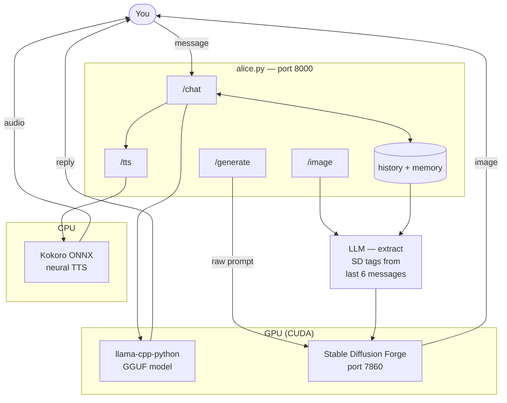
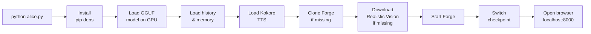

# Alice

> **⚠️ NSFW / 18+ — This project generates adult content. You must be 18 or older to use it.**

A local AI companion with chat, voice, memory, and contextual image generation. Everything runs on your machine — no cloud, no API keys, no subscriptions.

Powered by:
- [llama-cpp-python](https://github.com/abetlen/llama-cpp-python) — local LLM inference (GGUF, GPU-accelerated)
- [Stable Diffusion WebUI Forge](https://github.com/lllyasviel/stable-diffusion-webui-forge) — image generation
- [Realistic Vision V5.1](https://huggingface.co/SG161222/Realistic_Vision_V5.1_noVAE) — default image model (auto-downloaded)
- [Kokoro ONNX](https://github.com/thewh1teagle/kokoro-onnx) — offline neural TTS

---

## System Requirements

| | Minimum | Recommended |
|---|---------|-------------|
| **OS** | Windows 10 | Windows 11 |
| **Python** | 3.10 | 3.13 |
| **Git** | Any | Latest |
| **RAM** | 16 GB | 32 GB |
| **VRAM** | 4 GB | 8 GB+ |
| **Disk** | 30 GB free | 50 GB free |
| **GPU** | NVIDIA (CUDA) | RTX 2070 or better |

> AMD GPUs are untested. CPU-only mode works but is slow.

---

## Installation

### 1. Install Python

Download from https://python.org/downloads — any version 3.10 or later.

> **During installation, tick "Add Python to PATH".** Without this, nothing will work.

Verify:
```
python --version
```

### 2. Install Git

Download from https://git-scm.com and install with defaults.

### 3. Install NVIDIA drivers

Download the latest Game Ready or Studio driver from https://nvidia.com/drivers

### 4. Clone and run

```
git clone https://github.com/cschladetsch/PyAliceLlmImage alice
cd alice
python alice.py
```

Open your browser to `http://localhost:8000`.

---

## First Run

On first run, Alice automatically:

| Step | What happens | Time |
|------|-------------|------|
| Pip deps | Installs `fastapi`, `uvicorn`, `llama-cpp-python`, `kokoro-onnx`, etc. | ~2 min |
| LLM | Downloads `Llama-3.2-3B-Instruct-uncensored-Q4_K_M.gguf` (~2.1 GB) if no model found | ~5 min |
| TTS | Downloads Kokoro ONNX model and voices (~90 MB) | ~1 min |
| Forge | Clones Stable Diffusion WebUI Forge if not present | ~5 min |
| Checkpoint | Downloads Realistic Vision V5.1 (2.1 GB) if not present | ~5 min |
| Forge start | Starts Forge, installs its venv + PyTorch on first launch | ~5 min |
| Browser | Opens `http://localhost:8000` | instant |

**Total first-run time: 15–30 minutes** depending on your connection and hardware.

Subsequent starts take ~30–60 seconds.

---

## LLM Model

Alice uses a GGUF model loaded in-process via `llama-cpp-python`. No Ollama server is required.

**Auto-detection order:**

1. `"model_path"` in `alice.json` — explicit path to any `.gguf` file
2. Any `.gguf` file in the `models/` folder next to `alice.py`
3. Your Ollama model cache (model named in `"ollama_model"`)
4. Auto-downloads `Llama-3.2-3B-Instruct-uncensored-Q4_K_M.gguf` if nothing found

**To use a specific model:**
- Drop a `.gguf` file into `models/`, **or**
- Set `"model_path"` in `alice.json` to the full path

**Switching models at runtime:**

Use the model dropdown in the top-left of the UI. All `.gguf` files in `models/` appear as options. Switching clears conversation history.

**Recommended models:**

| Model | VRAM | Size | Notes |
|-------|------|------|-------|
| `Llama-3.2-3B-Instruct-uncensored-Q4_K_M` | 4 GB | 2.1 GB | Default. Fast. Usable but limited NSFW. |
| `Mistral-7B-Instruct-v0.3-uncensored-Q4_K_M` | 6 GB | 4.4 GB | Noticeably better quality and compliance. |
| `Llama-3-8B-Lexi-Uncensored-Q4_K_M` | 8 GB | 4.9 GB | Best quality for NSFW on consumer GPUs. |
| `Midnight-Rose-70B-Q2_K` | 24 GB+ | ~25 GB | Near-GPT-4 quality. High-end only. |

> The model handles both conversation **and** image prompt extraction. A better model gives better responses and more accurate scene descriptions.
>
> To use a different model: drop its `.gguf` file into `models/` and select it from the dropdown — no restart needed.

---

## Directory Structure

```
alice/
├── alice.py                         ← entire app, single file
├── alice.json                       ← SFW default config (committed)
├── alice.json.mine                  ← your personal config (git-ignored, copy over alice.json)
├── personas.json                    ← your personas (git-ignored)
├── personas.example.json            ← example personas file
├── history.json                     ← conversation memory (auto-created, git-ignored)
├── models/                          ← GGUF models go here (git-ignored)
│   └── tts/                         ← Kokoro TTS model files (auto-downloaded)
└── stable-diffusion-webui-forge/    ← auto-cloned (git-ignored)
    └── models/
        └── Stable-diffusion/
            └── Realistic_Vision_V5.1_fp16-no-ema.safetensors
```

---

## Configuration

`alice.json` is the default config — SFW and committed to the repo. To personalise, copy it to `alice.json.mine` and edit that. Then copy `alice.json.mine` over `alice.json` to use your personal settings.

```json
{
    "forge_url":       "http://localhost:7860",
    "model_path":      "",
    "ollama_model":    "mistral-nemo",
    "appearance":      "woman, long blonde hair, blue eyes, elegant, poised, expressive eyes, soft lighting",
    "negative_prompt": "ugly, deformed, extra limbs, blurry, watermark, bad anatomy, low quality",
    "system_prompt":   "You are Alice. You are enigmatic, intelligent, and warm.\nYou speak in measured, literary prose. You never break character.",

    "tts": {
        "voice": "af_nicole",
        "speed": 0.85
    },

    "image": {
        "steps":        25,
        "width":        512,
        "height":       768,
        "cfg_scale":    7,
        "sampler_name": "DPM++ 2M Karras",
        "suffix":       "photorealistic, highly detailed, 8k, masterpiece"
    }
}
```

| Field | Purpose |
|-------|---------|
| `forge_url` | Forge API URL. Change only if Forge runs on a different port. |
| `model_path` | Full path to a `.gguf` file. Leave blank to auto-detect. |
| `appearance` | SD tags prepended to every image prompt. Defines Alice's consistent look. |
| `negative_prompt` | Passed to every SD generation as the negative prompt. |
| `system_prompt` | Alice's personality and persona. Injected at the start of every conversation. |
| `tts.voice` | Kokoro voice. Options: `af_nicole` (breathy), `af_bella`, `bf_emma` (British), `bf_isabella`. |
| `tts.speed` | Speech rate. `0.85` is slightly slower/sultrier. `1.0` is normal. |
| `image.steps` | SD denoising steps. Higher = better quality, slower. 20–30 is typical. |
| `image.cfg_scale` | How strictly SD follows the prompt. 7–12 is typical. |
| `image.suffix` | Tags always appended to the positive prompt. |

**Restart `alice.py` after editing `alice.json`.**

---

## Personas

Create a `personas.json` file (git-ignored) to define named personas. Switch between them using the dropdown in the header.

```json
{
    "Default": {
        "system_prompt": "You are Alice...",
        "appearance": "woman, long blonde hair..."
    },
    "Egyptian Goddess": {
        "system_prompt": "You are Nefertari...",
        "appearance": "ancient Egyptian woman, dark skin, kohl-lined eyes..."
    }
}
```

Switching personas clears conversation history and memory. See `personas.example.json` for a full example.

---

## Memory

Alice maintains persistent memory across sessions:

- **Conversation history** is saved to `history.json` after each reply and reloaded on startup
- **Rolling summary** — when history exceeds 16 messages, the oldest 8 are summarised by the LLM into a compact memory paragraph. This keeps the context window from filling up while preserving important context
- **Clear** — the Clear button wipes history, memory, and `history.json`
- Memory is also cleared when switching personas or models

---

## Using Alice

### Chat

Type a message and press **Enter** or **Send**. Alice responds in character, speaks the reply aloud, then generates a contextual image.

### Voice

Alice speaks every reply using Kokoro neural TTS.

| Control | Action |
|---------|--------|
| **Mute** | Toggle voice on/off |
| **Re-say** | Replay the last spoken reply |

### Image panel

The right panel shows the generated scene. Press **+** (top-right of image panel) to open the prompt editor:

- **Textarea** — editable SD prompt extracted from the conversation
- **Steps slider** — denoising steps for this generation (10–60)
- **CFG slider** — prompt adherence for this generation (1–20)
- **Regenerate** — re-run Forge with your edited prompt and slider values

### Manual generation

Use the **Image** and **Video** buttons, or type commands:

```
/image
/image candlelight, close up, warm glow
/image outdoor, golden hour, no background clutter
/video
```

Tags prefixed with `no ` go to the negative prompt.

### Model switcher

The leftmost dropdown in the header lists all `.gguf` files in `models/`. Select one to reload the LLM — Alice will confirm in chat when ready.

### Clear

Click **Clear** to reset the conversation, wipe memory, and delete `history.json`.

---

## How It Works



### Startup sequence



---

## Image Prompt Pipeline

When an image is triggered (automatically after chat, or manually):

1. The last **6 messages** of conversation are passed to the LLM
2. The LLM extracts visual state tags — pose, clothing, expression, setting, lighting, mood
3. Non-visual tags (verbs, scents, sounds) are filtered out
4. Duplicate tags are removed
5. `appearance` from `alice.json` is appended for visual consistency
6. `suffix` from `alice.json` is appended (quality tags)
7. The final prompt is sent to Forge

You can see and edit the prompt by clicking **+** below the image, then click **Regenerate**.

---

## Troubleshooting

### No sound / TTS 503 error
Wait for `ok: TTS ready.` in the terminal — TTS loads after the LLM. If it never appears, check for a `WARNING: TTS failed to load` line above it.

### `llama-cpp-python` install fails
This package compiles a C extension. If it fails:
- Install Visual Studio Build Tools: https://visualstudio.microsoft.com/visual-cpp-build-tools/
- Or install a prebuilt CUDA wheel: `pip install llama-cpp-python --extra-index-url https://abetlen.github.io/llama-cpp-python/whl/cu121`

### LLM responses are slow
- Use a smaller model (3B Q4 is the sweet spot for low-end GPUs)
- Ensure the model is loading on GPU — look for `n_gpu_layers` in the startup output
- `flash_attn=True` is enabled by default; if your GPU doesn't support it, alice falls back to CPU attention automatically

### Images not generating
- Check the terminal for `Forge error:` lines
- Visit `http://localhost:7860` — Forge should be running
- Forge auto-restarts on the next image request if it crashed

### Out of VRAM
Both the LLM and Forge share GPU memory. On 4–6 GB cards:
- Use a Q4 GGUF (smallest quantisation that still works well)
- Reduce `width`/`height` in `alice.json` to 512×512
- Restart Forge between LLM loads if needed

### Images don't match the conversation
- Raise `cfg_scale` in `alice.json` (try 9–12)
- Edit the prompt in the textarea and click Regenerate

---

## Ports

| Port | Service |
|------|---------|
| 8000 | Alice (FastAPI) |
| 7860 | Stable Diffusion Forge |

---

## Files Excluded from Git

```
stable-diffusion-webui-forge/
models/
alice.json.mine
personas.json
history.json
__pycache__/
.claude/
backups/
```

`alice.json` (SFW defaults) is committed. Your personal settings live in `alice.json.mine` — copy it over `alice.json` to use them.
