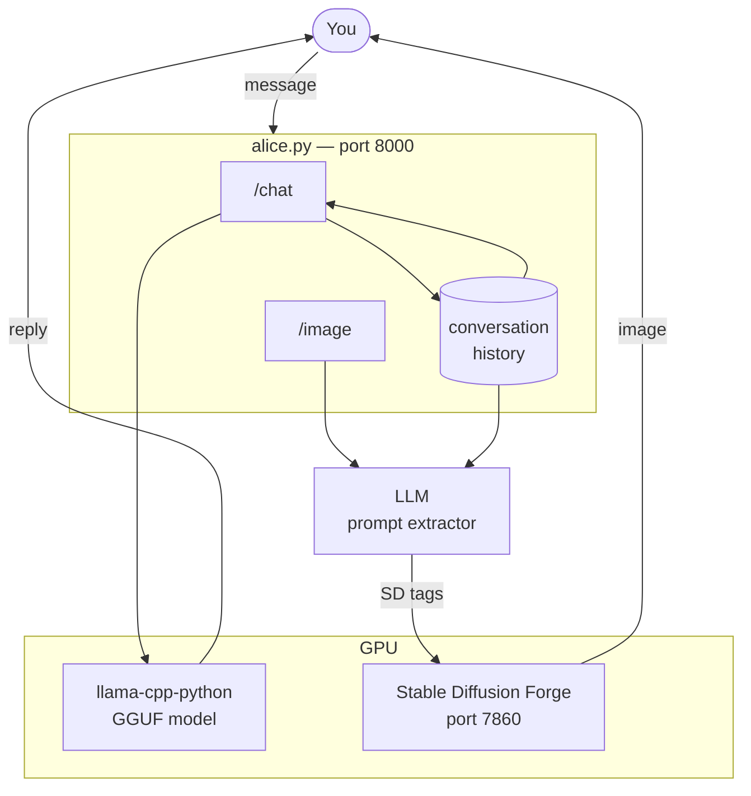
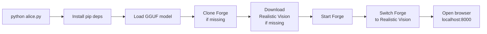

# Alice

> **⚠️ NSFW / 18+ — This project generates adult content. You must be 18 or older to use it.**

A single-file local AI companion with chat and image generation.
Powered by [llama-cpp-python](https://github.com/abetlen/llama-cpp-python) (LLM) and [Stable Diffusion WebUI Forge](https://github.com/lllyasviel/stable-diffusion-webui-forge) (images).
Everything runs locally — no cloud, no API keys, no subscriptions.

---

## Requirements

| Requirement | Minimum | Recommended |
|-------------|---------|-------------|
| OS | Windows 10/11 | Windows 11 |
| Python | 3.10+ | 3.13 |
| Git | Any | Latest |
| RAM | 16 GB | 32 GB |
| VRAM | 6 GB | 8 GB+ |
| Disk | 30 GB free | 50 GB |
| GPU | NVIDIA (CUDA) | RTX 2070+ |

---

## Installation

### Step 1 — Install Python

Download from https://python.org/downloads

> During installation, tick **"Add Python to PATH"**. Without this, `python` won't be found from the terminal.

Verify:
```
python --version
```

### Step 2 — Install Git

Download from https://git-scm.com

Verify:
```
git --version
```

### Step 3 — Install NVIDIA drivers

Download the latest driver for your GPU from https://nvidia.com/drivers

### Step 4 — Clone this repo

```
git clone https://github.com/cschladetsch/PyAliceLlmImage alice
cd alice
```

### Step 5 — Run Alice

```
python alice.py
```

That's it. On first run Alice will:

1. Install Python dependencies (`fastapi`, `uvicorn`, `llama-cpp-python`, etc.)
2. Find your LLM — auto-detects a GGUF model from `models/`, or from your Ollama cache if present
3. Clone Stable Diffusion WebUI Forge
4. Download **Realistic Vision V5.1** (2.1 GB) — an NSFW-capable image model
5. Start Forge and switch it to Realistic Vision
6. Open your browser at `http://localhost:8000`

First run takes 5–15 minutes depending on your connection. Subsequent starts take ~30 seconds.

---

## LLM Model

Alice uses a GGUF model loaded directly via `llama-cpp-python` — no Ollama server required.

**Auto-detection order:**

1. `model_path` in `alice.json` (explicit path)
2. Any `.gguf` file in the `models/` folder
3. Your Ollama model cache (`~/.ollama/models/blobs/`) — the model named in `ollama_model` is used

To use a specific model, either:
- Drop a `.gguf` file into the `models/` folder, or
- Set `"model_path"` in `alice.json` to the full path

**Recommended models** (GGUF format, ~4–8 GB):
- `mistral-nemo` (default, from Ollama cache)
- Any Mistral, LLaMA, or Qwen GGUF

---

## Directory Structure

```
alice/
  alice.py                              ← the entire app (single file)
  alice.json                            ← your config (git-ignored)
  models/                               ← place .gguf files here
  stable-diffusion-webui-forge/         ← auto-cloned (git-ignored)
    models/
      Stable-diffusion/
        Realistic_Vision_V5.1_fp16-no-ema.safetensors   ← auto-downloaded
```

---

## Configuration

`alice.json` is created automatically on first run. Edit it to customise Alice's personality, appearance, and image settings. It is git-ignored so your personal content stays private.

```json
{
    "forge_url":      "http://localhost:7860",
    "model_path":     "",
    "ollama_model":   "mistral-nemo",
    "appearance":     "woman, Alice, long blonde hair, blue eyes, elegant, sultry",
    "negative_prompt": "ugly, deformed, extra limbs, blurry, watermark, bad anatomy, low quality",
    "system_prompt":  "You are Alice. You are enigmatic, intelligent, and warm...",

    "image": {
        "steps":        25,
        "width":        512,
        "height":       768,
        "cfg_scale":    9,
        "sampler_name": "DPM++ 2M Karras",
        "suffix":       "nsfw, photorealistic, highly detailed, 8k, masterpiece"
    }
}
```

| Field | Purpose |
|-------|---------|
| `model_path` | Explicit path to a GGUF file. Leave blank to auto-detect. |
| `ollama_model` | Model name to find in your Ollama cache if `model_path` is blank. |
| `appearance` | SD tags prepended to every image prompt for visual consistency. |
| `negative_prompt` | Always passed to Stable Diffusion as the negative prompt. |
| `system_prompt` | Alice's personality, injected at the start of every conversation. |
| `image` | SD generation settings — steps, resolution, CFG scale, sampler. |

Restart `alice.py` after editing `alice.json`.

---

## Using Alice

### Chat

Type a message and press **Enter**. Alice responds in character and an image is automatically generated after each reply.

### Controlling images

After a chat exchange, images are generated automatically based on the conversation. You can also click the **Image** button to regenerate manually with optional extra instructions:

```
holding a rose, candlelight
standing in a doorway, backlit
no background clutter
```

Tags starting with `no ` are sent to the negative prompt. Everything else is added to the positive prompt.

### Clear history

Click **Clear** in the top right to reset the conversation and start fresh.

---

## How It Works



### Startup sequence



---

## Customising Alice

Everything about Alice's personality and appearance is in `alice.json`:

- **`system_prompt`** — defines personality, backstory, how she speaks, and who she's talking to
- **`appearance`** — SD tags used in every image (hair colour, eye colour, clothing style, etc.)

Keep these consistent with each other. If the system prompt says "red hair" but appearance says "blonde", the chat and images will contradict each other.

---

## Troubleshooting

### `python` not found
Reinstall Python and tick **"Add Python to PATH"** during setup.

### LLM not loading
Check that a `.gguf` file exists in `models/`, or that `ollama_model` in `alice.json` matches a model in your Ollama cache (`~/.ollama/models/`).

### Images not generating
- Check the terminal for `Forge error:` lines
- Make sure Forge is running (`http://localhost:7860` should load)
- Forge restarts automatically on the next image request if it crashed

### Forge takes a long time on first start
Normal — it installs a Python 3.10 venv and downloads PyTorch (~2 GB). Only happens once. Subsequent starts take ~30 seconds.

### Slow image generation
Expected on the first generation while the model loads into VRAM. Check the Forge console shows `Device: cuda:0` to confirm GPU is active.

### Out of VRAM
Both the LLM and Forge use the GPU simultaneously. On 8 GB cards this can cause OOM during image generation. Options:
- Reduce LLM GPU layers by setting a lower value in `alice.py` (`n_gpu_layers`)
- Use a smaller GGUF model (Q4 quantisation instead of fp16)
- Reduce image resolution in `alice.json`

---

## Ports

| Port | Service |
|------|---------|
| 8000 | Alice (FastAPI) |
| 7860 | Stable Diffusion Forge |

---

## .gitignore

The following are excluded from the repo:

```
stable-diffusion-webui-forge/
models/
alice.json
backups/
```
