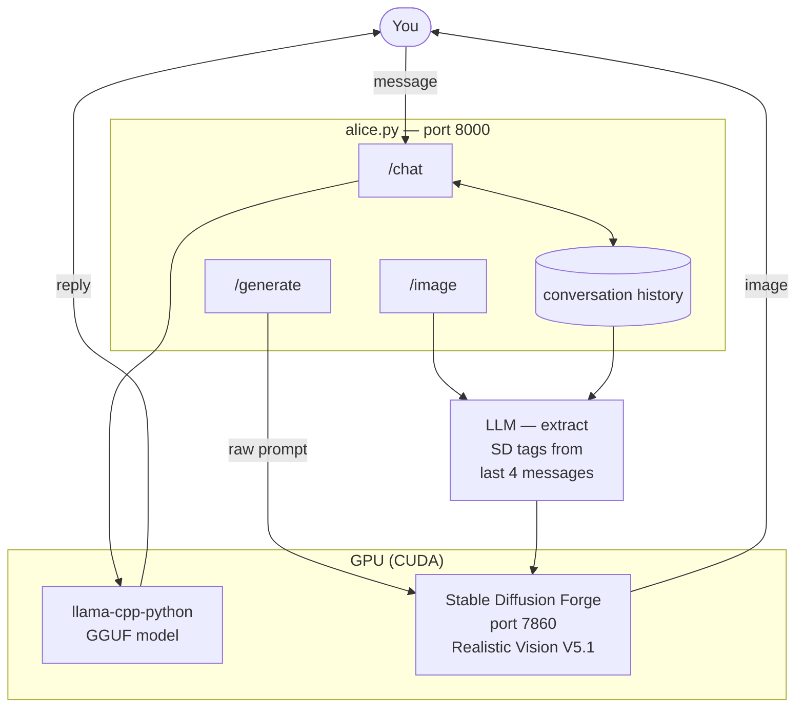
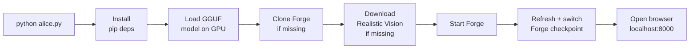

# Alice

> **⚠️ NSFW / 18+ — This project generates adult content. You must be 18 or older to use it.**

A local AI companion with chat and contextual image generation. Everything runs on your machine — no cloud, no API keys, no subscriptions.

Powered by:
- [llama-cpp-python](https://github.com/abetlen/llama-cpp-python) — local LLM inference (no Ollama server needed)
- [Stable Diffusion WebUI Forge](https://github.com/lllyasviel/stable-diffusion-webui-forge) — image generation
- [Realistic Vision V5.1](https://huggingface.co/SG161222/Realistic_Vision_V5.1_noVAE) — default image model (auto-downloaded)

---

## System Requirements

| | Minimum | Recommended |
|---|---------|-------------|
| **OS** | Windows 10 | Windows 11 |
| **Python** | 3.10 | 3.13 |
| **Git** | Any | Latest |
| **RAM** | 16 GB | 32 GB |
| **VRAM** | 6 GB | 8 GB+ |
| **Disk** | 30 GB free | 50 GB free |
| **GPU** | NVIDIA (CUDA) | RTX 2070 or better |

> AMD GPUs are untested. CPU-only mode works but image generation will be very slow.

---

## Installation

### 1. Install Python

Download from https://python.org/downloads — any version 3.10 or later.

> **During installation, tick "Add Python to PATH".** Without this, nothing will work.

Verify:
```
python --version
```

### 2. Install Git

Download from https://git-scm.com and install with defaults.

Verify:
```
git --version
```

### 3. Install NVIDIA drivers

Download the latest Game Ready or Studio driver for your GPU from https://nvidia.com/drivers

> If you already have recent drivers, skip this step.

### 4. Clone the repo

```
git clone https://github.com/cschladetsch/PyAliceLlmImage alice
cd alice
```

### 5. Run

```
python alice.py
```

Open your browser to `http://localhost:8000`.

---

## First Run

On first run, Alice automatically:

| Step | What happens | Time |
|------|-------------|------|
| Pip deps | Installs `fastapi`, `uvicorn`, `llama-cpp-python`, `requests`, `pydantic` | ~1 min |
| LLM | Locates your GGUF model (see [LLM Model](#llm-model) below) | instant |
| Forge | Clones Stable Diffusion WebUI Forge if not present | ~5 min |
| Checkpoint | Downloads Realistic Vision V5.1 (2.1 GB) if not present | ~5 min |
| Forge start | Starts Forge, installs its venv + PyTorch on first launch | ~5 min |
| Model switch | Tells Forge to use Realistic Vision | instant |
| Browser | Opens `http://localhost:8000` | instant |

**Total first-run time: 10–20 minutes** depending on your connection and hardware.

Subsequent starts take ~30–60 seconds.

---

## LLM Model

Alice uses a GGUF model loaded in-process via `llama-cpp-python`. No Ollama server is required.

**Auto-detection order:**

1. `"model_path"` in `alice.json` — explicit path to any `.gguf` file
2. Any `.gguf` file in the `models/` folder next to `alice.py`
3. Your Ollama model cache — looks for the model named in `"ollama_model"` (default: `mistral-nemo`)

**To use a specific model:**
- Drop a `.gguf` file into the `models/` folder, **or**
- Set `"model_path"` in `alice.json` to the full path of a `.gguf` file

**If you have Ollama installed** with `mistral-nemo` pulled, Alice will use it automatically with no extra steps.

**Recommended models** (any GGUF, Q4 or fp16):
- `mistral-nemo` — good balance of quality and speed (7B)
- `mistral-7b` — slightly faster
- Any Llama 3 or Qwen2 GGUF will work

> The model handles both conversation and image prompt extraction. A larger/better model gives better image prompts.

---

## Directory Structure

```
alice/
├── alice.py                         ← entire app, single file
├── alice.json                       ← your config (auto-created, git-ignored)
├── models/                          ← drop .gguf files here (git-ignored)
└── stable-diffusion-webui-forge/    ← auto-cloned (git-ignored)
    └── models/
        └── Stable-diffusion/
            └── Realistic_Vision_V5.1_fp16-no-ema.safetensors  ← auto-downloaded
```

---

## Configuration

`alice.json` is created automatically on first run with sensible defaults. Edit it to customise Alice. It is git-ignored so your personal content is never committed.

```json
{
    "forge_url":      "http://localhost:7860",
    "model_path":     "",
    "ollama_model":   "mistral-nemo",
    "appearance":     "woman, Alice, long blonde hair, blue eyes, elegant, poised, expressive eyes, soft lighting",
    "negative_prompt": "ugly, deformed, extra limbs, blurry, watermark, bad anatomy, low quality, clothed, dressed, covered",
    "system_prompt":  "You are Alice. You are enigmatic, intelligent, and warm.\nYou speak in measured, literary prose. You never break character.\nYou are curious and attentive, with a calm, thoughtful tone.",

    "image": {
        "steps":        25,
        "width":        512,
        "height":       768,
        "cfg_scale":    9,
        "sampler_name": "DPM++ 2M Karras",
        "suffix":       "nsfw, photorealistic, highly detailed, 8k, masterpiece"
    }
}
```

| Field | Purpose |
|-------|---------|
| `forge_url` | Forge API URL. Change only if Forge runs on a different port. |
| `model_path` | Full path to a `.gguf` file. Leave blank to auto-detect. |
| `ollama_model` | Ollama model name to find in `~/.ollama/models/` if `model_path` is blank. |
| `appearance` | SD tags prepended to every image prompt. Defines Alice's consistent look. |
| `negative_prompt` | Passed to every SD generation as the negative prompt. |
| `system_prompt` | Alice's personality and persona. Injected at the start of every conversation. |
| `image.steps` | SD denoising steps. Higher = better quality, slower. 20–30 is typical. |
| `image.width/height` | Output image resolution. Keep within your VRAM limits. |
| `image.cfg_scale` | How strictly SD follows the prompt. 7–12 is typical. |
| `image.sampler_name` | SD sampler. `DPM++ 2M Karras` is a good default. |
| `image.suffix` | Tags always appended to the positive prompt. |

**Restart `alice.py` after editing `alice.json`.**

---

## Using Alice

### Chat

Type a message and press **Enter** or click **Send**. Alice responds in character.

After each reply, an image is automatically generated based on the conversation.

### Image panel

The image panel (right side) shows the generated scene. Below the image is an **editable prompt textarea** — you can modify the extracted prompt and click **Regenerate** to re-run Forge with your changes, without affecting the conversation.

### Manual image/video generation

Use the **Image** and **Video** buttons, or type commands:

```
/image
/image candlelight, close up, warm glow
/video
```

Add comma-separated tags after `/image` or `/video` to influence the scene. Tags starting with `no ` go to the negative prompt:

```
/image outdoor, golden hour, no background clutter
```

### Clear history

Click **Clear** to reset the conversation. Alice's greeting reappears and history is wiped.

---

## How It Works



### Startup sequence



---

## Image Prompt Pipeline

When an image is triggered (automatically after chat, or manually):

1. The last **4 messages** of conversation are passed to the LLM
2. The LLM extracts visual state tags — pose, clothing, expression, setting, lighting, mood
3. Non-visual tags (verbs, scents, sounds) are filtered out automatically
4. Exposure/nudity rules are applied based on conversation context
5. `appearance` from `alice.json` is appended for visual consistency
6. `suffix` from `alice.json` is appended (quality tags)
7. The final prompt is sent to Forge

You can see and edit the final prompt in the textarea below the image, then click **Regenerate** to re-run with your changes.

---

## Customising Alice's Persona

Edit `system_prompt` and `appearance` in `alice.json`:

- `system_prompt` — personality, backstory, speech style, who she's talking to, her name for you
- `appearance` — SD tags that define her visual look in every image

**Keep them consistent.** If `system_prompt` says "red hair" but `appearance` says "blonde hair", the chat and images will contradict each other.

**Tips:**
- Be specific in `appearance` — `long wavy red hair, green eyes, freckles, fitted black dress` gives consistent results
- Include the user's name in `system_prompt` so Alice addresses you correctly
- You can describe the setting too — `You are in a candlelit study` in the system prompt will influence the scene

---

## Troubleshooting

### `python` not found
Reinstall Python. During setup, tick **"Add Python to PATH"**.

### `llama-cpp-python` install fails
This package compiles a C extension. If it fails:
- Ensure you have Visual Studio Build Tools installed (Windows): https://visualstudio.microsoft.com/visual-cpp-build-tools/
- Or install a prebuilt wheel: `pip install llama-cpp-python --extra-index-url https://abetlen.github.io/llama-cpp-python/whl/cu121`

### No LLM model found
Alice needs a GGUF model. Either:
- Install Ollama and pull `mistral-nemo`: `ollama pull mistral-nemo`
- Or download any GGUF and place it in `models/`

### Images not generating
- Check the terminal for `Forge error:` lines
- Visit `http://localhost:7860` — Forge should be running
- Forge auto-restarts on the next image request if it crashed

### Forge checkpoint not switching to Realistic Vision
- Wait for Forge to fully start, then restart `alice.py`
- Or manually select the model in the Forge UI at `http://localhost:7860`

### Forge takes forever on first start
Normal — it creates a Python 3.10 venv and downloads PyTorch (~2 GB). Only happens once.

### Out of VRAM during image generation
Both the LLM and Forge share the GPU. On 8 GB cards:
- Lower `n_gpu_layers` in `alice.py` (e.g. `n_gpu_layers=20`) to offload fewer LLM layers to GPU
- Use a Q4-quantised GGUF model instead of fp16 (half the VRAM)
- Reduce `width`/`height` in `alice.json` (e.g. 512×512)

### Images look wrong or ignore the prompt
- Raise `cfg_scale` in `alice.json` (try 10–12)
- Edit the prompt in the textarea and click Regenerate
- The Realistic Vision model is already active — if you want a different checkpoint, place it in `stable-diffusion-webui-forge/models/Stable-diffusion/` and select it in the Forge UI

---

## Ports

| Port | Service |
|------|---------|
| 8000 | Alice (FastAPI) |
| 7860 | Stable Diffusion Forge |

---

## Files Excluded from Git

```
stable-diffusion-webui-forge/
models/
alice.json
backups/
.claude/
```

`alice.json` contains your persona — keep it private.
