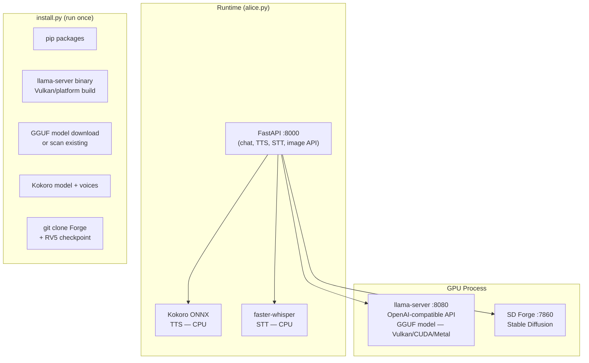
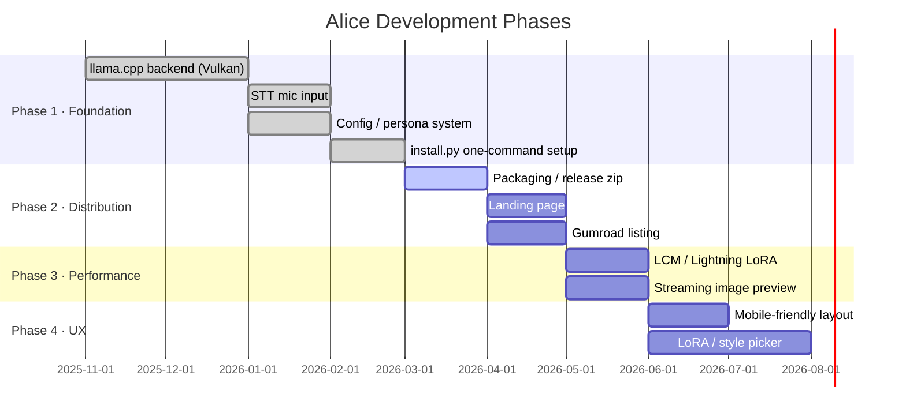
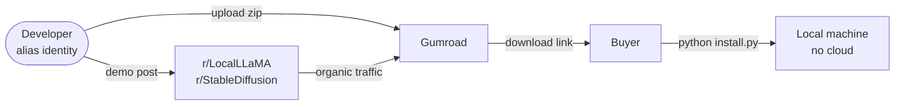

# Alice — Product Roadmap

## What It Is

Alice is a local-first AI companion with voice, chat, and image generation. It runs entirely on the user's hardware. No data leaves the machine. No cloud subscription required.

Key features:
- Natural language conversation via llama.cpp (GGUF models, OpenAI-compatible API)
- Real-time image generation from conversation context via Stable Diffusion Forge
- Neural TTS (Kokoro ONNX) and STT (Whisper) — fully offline
- NSFW capable — uncensored, fully local
- Split UI: chat + voice on left, generated scene on right
- Persona system — swap character, appearance, and system prompt at runtime
- Configurable via `alice.json`

## Why It's Different

- **Fully local** — nothing sent to any cloud API
- **Privacy by design** — suitable for users who won't trust cloud providers
- **One product** — chat, voice, STT, and image in a single interface
- **No ongoing subscription to an AI provider**
- **Works on NVIDIA and AMD GPUs** via Vulkan backend

The target user is already running local AI tools. They understand LLMs and Stable Diffusion. They want an experience, not a chatbot.

---

## Technical Stack

---

## Roadmap

### Phase 1 — Foundation (complete)

- [x] Switch LLM backend from Ollama to llama.cpp server (Vulkan, cross-GPU)
- [x] OpenAI-compatible API (`/v1/chat/completions`, streaming SSE)
- [x] STT push-to-talk with device selector, silence auto-stop, auto-send
- [x] Config hygiene — `alice.json.example` in repo, personal config gitignored
- [x] Persona system with runtime switching
- [x] Rolling conversation memory with LLM-based compression
- [x] `install.py` — one command sets up everything (llama-server, model, TTS, Forge)
- [x] `alice.py` — assumes installed, just runs

### Phase 2 — Distribution

- [ ] Package as a zip with a `start.bat` / `start.sh` launcher
- [ ] Gumroad listing under alias identity
- [ ] Demo gif / short clip for Reddit launch (r/LocalLLaMA, r/StableDiffusion)
- [ ] Simple landing page (single HTML, alias domain via Cloudflare)

### Phase 3 — Performance

Current image generation: ~30–60 s on RTX 2070 (8 GB VRAM).

- [ ] Evaluate LCM or Lightning LoRA at ~0.6 weight — target sub-10 s generation
- [ ] Streaming/progressive image preview during generation
- [ ] Reduce default steps to 20, CFG to 5–6 for better responsiveness

### Phase 4 — UX

- [ ] Mobile-friendly layout (portrait, swipeable panels)
- [ ] LoRA / style picker in the UI
- [ ] Persistent persona gallery with portrait thumbnails
- [ ] Voice activity indicator (animated waveform during recording)

---

## Distribution

### Identity separation

Alice must be developed, sold, and supported under a separate identity to protect the developer's professional profile.

- Separate GitHub account (alias)
- Separate email address
- Separate Gumroad and SubscribeStar accounts
- No cross-linking to real LinkedIn, GitHub, or professional identity
- Alias Reddit account for community engagement

The tech stack (llama.cpp, Forge, FastAPI, Python) is generic and leaves no fingerprints.

---

## Pricing

- **One-time purchase: $25 USD**
- Optional future tier: $5/month for updates and new personas

Rationale: the target audience is accustomed to paying for this category of software. $25 is an impulse buy. Underpricing signals low quality.

A free tier with limitations (capped personas, watermarked output) can drive paid conversions later.

---

## Summary

| Item | Detail |
|---|---|
| Product | Local AI companion — chat + voice + STT + image |
| Stack | llama.cpp, Stable Diffusion Forge, FastAPI, HTML/JS |
| GPU | NVIDIA and AMD via Vulkan |
| Price | $25 one-time |
| Platform | Gumroad (alias) |
| Distribution | Reddit organic |
| Identity | Fully separated alias |
| Current status | Working, install.py complete |
| Launch blocker | Packaging + Gumroad listing |
